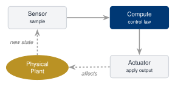
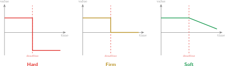
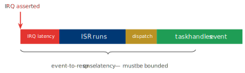

# Real-Time Operating Systems

## Week 1 — Foundations of Real-Time Systems

RT system taxonomy · hard / soft / firm deadlines · RTOS vs. GPOS

<div class="pt-10 opacity-70 text-sm">
  KMUTNB · Faculty of Engineering · M.Eng. in Electrical & Computer Engineering
</div>

<div class="abs-br m-6 text-xs opacity-50">
  Reading: Laplante Ch. 1–2 · Barry Ch. 1
</div>

<!--
This is the opening lecture of the course. Establish vocabulary precisely:
"real-time" is a technical term, not a synonym for "fast". Everything in the
remaining 15 weeks builds on the task model introduced today.
-->

---
layout: two-cols
layoutClass: gap-8
---

# The Course at a Glance

A graduate treatment of **real-time operating systems** — theory **and**
hands-on implementation on modern embedded hardware.

- **16 weeks**, 7 modules, 11 labs
- Theory: scheduling, synchronisation, timing analysis
- Practice: **FreeRTOS** on a dual-core Cortex-M33

The goal: you should be able to **design, build, and *prove* the timing
correctness** of an embedded real-time system.

::right::

<div class="mt-12 text-sm leading-relaxed">

| Module | Theme |
|--------|-------|
| 1 | Foundations of real-time systems |
| 2 | Real-time scheduling theory |
| 3 | Synchronisation & inter-task comm. |
| 4 | Timing analysis & memory |
| 5 | Advanced hardware (TrustZone, AMP) |
| 6 | Low-power & Zephyr RTOS |
| 7 | Research topics & final project |

</div>

<div class="mt-4 text-xs opacity-60">
Platform — NXP <b>FRDM-MCXN236</b> · dual Cortex-M33 @ 150 MHz · 512 KB SRAM
</div>

---

# Week 1 — Learning Objectives

By the end of this lecture you will be able to:

<v-clicks>

- **Define** a real-time system precisely, and explain why *"real-time ≠ fast"*.
- **Describe** the real-time task model: jobs, release times, deadlines, periods.
- **Classify** timing constraints as **hard**, **firm**, or **soft**, using utility functions.
- **Contrast** an RTOS with a general-purpose OS along the axis of *determinism*.
- **Identify** the key latency metrics that characterise an RTOS.
- **Recognise** the course toolchain and where FreeRTOS fits.

</v-clicks>

<div v-click class="mt-8 px-4 py-2 border-l-4 border-amber-500 bg-amber-50 dark:bg-amber-900/20 text-sm">
Maps to <b>CLO 1</b> — <i>Explain the theoretical foundations of real-time systems.</i>
</div>

---
layout: section
---

# Part 1
## What *is* a Real-Time System?

---

# Definition

<div class="mt-6 text-xl leading-relaxed">

A **real-time system** is one whose correctness depends **not only on the
*logical* result** of a computation, **but also on the *time* at which that
result is produced.**

</div>

<div v-click class="mt-10">

A late answer is a **wrong answer** — even if the value computed is perfect.

</div>

<div v-click class="mt-8 grid grid-cols-2 gap-6 text-sm">

<div class="px-4 py-3 rounded bg-gray-100 dark:bg-gray-800">
<b>General-purpose computing</b><br/>
correctness = <i>logical result</i>
</div>

<div class="px-4 py-3 rounded bg-blue-100 dark:bg-blue-900/40">
<b>Real-time computing</b><br/>
correctness = <i>logical result</i> &nbsp;<b>×</b>&nbsp; <i>timeliness</i>
</div>

</div>

<div v-click class="mt-6 text-sm opacity-75">
The deadline is part of the <b>specification</b>, not a performance wish-list item.
</div>

---
layout: statement
---

# Real-time ≠ Fast

A real-time system must be **predictable**,<br/> not necessarily **fast**.

<div class="mt-8 text-base opacity-80 max-w-2xl mx-auto">
A system that *usually* responds in 1 µs but *occasionally* takes 5 ms is
<b>worse</b> than one that <i>always</i> responds in 800 µs — if the deadline is 1 ms.
</div>

---

# Fast vs. Predictable — an Illustration

<div class="grid grid-cols-2 gap-8 mt-4">

<div>

### System A — "Fast"
- Average response: **1 µs**
- Worst case: **5 ms** (rare GC / cache miss / page fault)
- Deadline = 1 ms → **misses, occasionally**

<div class="mt-2 text-red-600 font-bold">✗ Not real-time safe</div>

</div>

<div>

### System B — "Predictable"
- Average response: **780 µs**
- Worst case: **820 µs** (tightly bounded)
- Deadline = 1 ms → **always met**

<div class="mt-2 text-green-600 font-bold">✓ Real-time safe</div>

</div>

</div>

<div v-click class="mt-8 text-center text-lg">

What matters is the <b>worst case</b>, not the average.<br/>
<span class="text-sm opacity-70">Real-time engineering is the engineering of <b>worst-case bounds</b>.</span>

</div>

---
layout: two-cols
layoutClass: gap-6
---

# Real-Time Systems Are Everywhere

Most are **embedded** and invisible — you only notice when timing fails.

<v-clicks>

- **Automotive** — airbag deployment, ABS, engine control, ADAS
- **Medical** — pacemakers, infusion pumps, ventilators
- **Industrial** — motor & motion control, PLCs, robotics
- **Aerospace** — flight control, avionics, attitude control
- **Consumer** — drones, hard-disk servo, camera autofocus
- **Telecom** — base-station signal processing

</v-clicks>

::right::

<div class="mt-14 px-5 py-4 rounded-lg bg-blue-50 dark:bg-blue-900/30 text-sm leading-relaxed">

**Airbag — a 50 ms problem**

From crash detection to full inflation the system has roughly **20–40 ms**.

- Inflate **too late** → occupant already hit the wheel
- Inflate **too early** → occupant not yet in position

Both the logical decision *and* its timing must be correct.

</div>

<div v-click class="mt-4 text-xs opacity-60">
The common thread: a computer coupled to a <b>physical process</b> that will not wait.
</div>

---

# The Control-Loop Perspective

A real-time system is a computer **coupled to physics**. Physics sets the clock.



<div class="mt-6 grid grid-cols-2 gap-6 text-sm">

<div v-click class="px-4 py-2 rounded bg-gray-100 dark:bg-gray-800">
The loop must close <b>every period</b> (e.g. every 1 ms for a motor controller).
Miss it and the control law operates on <b>stale</b> data.
</div>

<div v-click class="px-4 py-2 rounded bg-gray-100 dark:bg-gray-800">
The <b>deadline</b> is dictated by the plant's dynamics — by physics —
<b>not</b> chosen for the programmer's convenience.
</div>

</div>


---
layout: section
---

# Part 2
## Modeling Time — The Real-Time Task Model

---

# Anatomy of a Job

A **task** (τ) is recurring work; each instance is a **job**.

<div class="my-4 flex justify-center">

</div>

<div class="grid grid-cols-3 gap-3 text-xs">
<div><b>Cᵢ</b> — execution time (the <b>WCET</b> is the worst case)</div>
<div><b>Rᵢ</b> — response time (release → finish)</div>
<div><b>Schedulable</b> ⇔ Rᵢ ≤ Dᵢ for <b>every</b> job</div>
</div>

---

# Recurrence: Periodic, Aperiodic, Sporadic

<div class="grid grid-cols-3 gap-4 mt-6 text-sm">

<div class="px-4 py-4 rounded-lg bg-blue-50 dark:bg-blue-900/30">
<div class="text-base font-bold text-blue-800 dark:text-blue-300">Periodic</div>
<div class="mt-2">Released at a <b>fixed interval T</b>.</div>
<div class="mt-2 opacity-80">Sensor sampling, control loops, the 1 kHz tick.</div>
<div class="mt-2 text-xs opacity-70">Predictable → easiest to analyse.</div>
</div>

<div class="px-4 py-4 rounded-lg bg-amber-50 dark:bg-amber-900/30">
<div class="text-base font-bold text-amber-700 dark:text-amber-300">Aperiodic</div>
<div class="mt-2">Released at <b>arbitrary, unknown</b> times.</div>
<div class="mt-2 opacity-80">User input, asynchronous events.</div>
<div class="mt-2 text-xs opacity-70">Usually has a <b>soft</b> deadline.</div>
</div>

<div class="px-4 py-4 rounded-lg bg-rose-50 dark:bg-rose-900/30">
<div class="text-base font-bold text-rose-700 dark:text-rose-300">Sporadic</div>
<div class="mt-2">Irregular, but with a <b>minimum inter-arrival time</b>.</div>
<div class="mt-2 opacity-80">Alarms, fault interrupts.</div>
<div class="mt-2 text-xs opacity-70">Bounded rate → <b>hard</b> deadline analysable.</div>
</div>

</div>

<div v-click class="mt-8 text-sm px-4 py-2 border-l-4 border-blue-700 bg-blue-50 dark:bg-blue-900/20">
The <b>minimum inter-arrival time</b> is what makes a sporadic task tractable:
it bounds the worst-case demand, so schedulability can still be proven.
</div>

---
layout: two-cols
layoutClass: gap-6
---

# Task Parameters & Utilization

For a periodic task **τᵢ** we track:

| Symbol | Meaning |
|--------|---------|
| $C_i$ | worst-case execution time (WCET) |
| $T_i$ | period |
| $D_i$ | relative deadline |
| $\Phi_i$ | phase (first release offset) |

A common simplification: **implicit deadlines**, $D_i = T_i$.

::right::

<div class="mt-14">

### Processor Utilization

$$ U \;=\; \sum_{i=1}^{n} \frac{C_i}{T_i} $$

The fraction of CPU time the task set **demands**.

<div class="mt-4 text-sm">

- $U > 1$ → **infeasible** on one core, always
- $U \le 1$ → *necessary*, but **not sufficient**
- The gap between "$U \le 1$" and "actually schedulable" is what **Module 2** is about.

</div>

</div>

---

# Worked Example — Utilization

Three periodic tasks share one CPU core:

<div class="mt-4">

| Task | $C_i$ (ms) | $T_i$ (ms) | $U_i = C_i / T_i$ |
|------|-----------|-----------|-------------------|
| τ₁ | 1 | 4 | 0.250 |
| τ₂ | 2 | 8 | 0.250 |
| τ₃ | 3 | 16 | 0.1875 |

</div>

<div v-click class="mt-4 text-lg">

$$ U = 0.250 + 0.250 + 0.1875 = \mathbf{0.6875} \;\;(68.75\%) $$

</div>

<div v-click class="mt-4 grid grid-cols-2 gap-4 text-sm">
<div class="px-4 py-2 rounded bg-green-100 dark:bg-green-900/30">
$U \le 1$, so the set is <b>not</b> trivially infeasible. Good.
</div>
<div class="px-4 py-2 rounded bg-amber-100 dark:bg-amber-900/30">
But is it <b>schedulable</b> under a real algorithm? That needs a test — Week 3.
</div>
</div>

---
layout: section
---

# Part 3
## Classifying Deadlines — Hard, Firm, Soft

---

# Hard, Firm, Soft

The **consequence of a missed deadline** defines the class.

<div class="grid grid-cols-3 gap-4 mt-6 text-sm">

<div class="px-4 py-4 rounded-lg border-2 border-red-400 bg-red-50 dark:bg-red-900/20">
<div class="text-base font-bold text-red-700 dark:text-red-300">Hard</div>
<div class="mt-2">A miss is a <b>system failure</b> — possibly catastrophic.</div>
<div class="mt-2 opacity-80">Airbag, flight control, pacemaker, ABS.</div>
<div class="mt-2 text-xs opacity-70">Must be <b>guaranteed</b> by analysis.</div>
</div>

<div class="px-4 py-4 rounded-lg border-2 border-amber-400 bg-amber-50 dark:bg-amber-900/20">
<div class="text-base font-bold text-amber-700 dark:text-amber-300">Firm</div>
<div class="mt-2">A late result is <b>useless</b> — discard it — but does no harm.</div>
<div class="mt-2 opacity-80">Video frame, sensor-fusion sample.</div>
<div class="mt-2 text-xs opacity-70">A few misses tolerated; value = 0 after deadline.</div>
</div>

<div class="px-4 py-4 rounded-lg border-2 border-green-400 bg-green-50 dark:bg-green-900/20">
<div class="text-base font-bold text-green-700 dark:text-green-300">Soft</div>
<div class="mt-2">A late result still has <b>degraded value</b>.</div>
<div class="mt-2 opacity-80">UI refresh, audio buffer, telemetry log.</div>
<div class="mt-2 text-xs opacity-70">Goal: keep misses rare / small.</div>
</div>

</div>

<div v-click class="mt-6 text-center text-sm opacity-80">
One <b>system</b> usually mixes all three — this is a property of each <b>task</b>, not the box.
</div>

---

# Utility After the Deadline

Plot the **value** of a result against its **completion time**:

<div class="flex justify-center mt-3">

</div>

<div class="grid grid-cols-3 gap-6 mt-1 text-center text-xs opacity-70">
<div>value plunges far negative — catastrophe</div>
<div>value drops to zero — result discarded</div>
<div>value decays gradually — still useful</div>
</div>

<div v-click class="mt-4 text-sm text-center px-4 py-2 rounded bg-gray-100 dark:bg-gray-800">
The shape of this curve <b>is</b> the formal definition of the deadline class.
</div>

---

# Classify These

<div class="text-sm">

| System / task | Class | Why |
|---------------|-------|-----|
| Anti-lock brake pressure update | <span class="text-red-600 font-bold">Hard</span> | a miss → loss of control |
| Drone attitude stabilisation loop | <span class="text-red-600 font-bold">Hard</span> | a miss → the aircraft tumbles |
| Video decoder — one frame | <span class="text-amber-600 font-bold">Firm</span> | a late frame is dropped, not shown |
| Networked sensor-fusion sample | <span class="text-amber-600 font-bold">Firm</span> | stale data discarded; next sample used |
| Audio playback buffer fill | <span class="text-green-600 font-bold">Soft</span> | rare underrun → a click, tolerable |
| Dashboard / GUI refresh | <span class="text-green-600 font-bold">Soft</span> | a slow update only annoys the user |

</div>

<div v-click class="mt-6 text-sm px-4 py-2 border-l-4 border-amber-500 bg-amber-50 dark:bg-amber-900/20">
"Hard" is about <b>consequence</b>, not <b>speed</b>. A hard deadline of 1 <b>second</b>
is still hard if missing it crashes the system.
</div>

---
layout: section
---

# Part 4
## RTOS vs. General-Purpose OS

---
layout: two-cols
layoutClass: gap-6
---

# What an OS Kernel Does

Whatever the OS, the **kernel** provides:

- **Scheduling** — which task runs on the CPU, when
- **Concurrency** — multiple tasks, one (or few) cores
- **Synchronisation** — semaphores, mutexes, queues
- **Interrupt handling** — bridging hardware to software
- **Memory & resource management**

::right::

<div class="mt-12 px-5 py-4 rounded-lg bg-blue-50 dark:bg-blue-900/30 text-sm leading-relaxed">

The difference between a **GPOS** and an **RTOS** is **not** the *list*
of services —

it is the **policy** behind each one, and the **guarantees** it can make.

<div class="mt-3 opacity-80">
A GPOS optimises the <b>common case</b>.<br/>
An RTOS bounds the <b>worst case</b>.
</div>

</div>

---

# Two Different Design Goals

<div class="grid grid-cols-2 gap-6 mt-6">

<div class="px-5 py-4 rounded-lg bg-gray-100 dark:bg-gray-800">
<div class="text-lg font-bold">GPOS — e.g. Linux, Windows, macOS</div>
<div class="mt-3 text-sm">Optimises <b>average-case</b> behaviour for many users & apps.</div>
<ul class="mt-2 text-sm">
<li>Maximise <b>throughput</b></li>
<li><b>Fairness</b> across processes</li>
<li>Good <b>interactive feel</b> on average</li>
<li>Rich features, large footprint (MBs–GBs)</li>
</ul>
<div class="mt-3 text-xs opacity-70">Worst-case latency: unbounded & not a design concern.</div>
</div>

<div class="px-5 py-4 rounded-lg bg-blue-100 dark:bg-blue-900/40">
<div class="text-lg font-bold text-blue-900 dark:text-blue-200">RTOS — e.g. FreeRTOS, Zephyr</div>
<div class="mt-3 text-sm">Optimises <b>worst-case</b> behaviour for known tasks.</div>
<ul class="mt-2 text-sm">
<li><b>Determinism</b> — bounded, repeatable timing</li>
<li><b>Priority</b>, not fairness</li>
<li>Bounded <b>interrupt & dispatch latency</b></li>
<li>Small footprint (KBs), often no MMU</li>
</ul>
<div class="mt-3 text-xs opacity-70">Worst-case latency: measured, bounded, guaranteed.</div>
</div>

</div>

---

# RTOS vs. GPOS — Side by Side

<div class="text-sm">

| Aspect | General-Purpose OS | Real-Time OS |
|--------|--------------------|--------------| 
| Primary goal | Throughput, fairness | **Determinism**, predictability |
| Optimises | Average case | **Worst case** |
| Scheduling | Fair / dynamic (e.g. CFS) | **Fixed-priority preemptive** |
| Task priority | Advisory, may be aged | **Strict** — honoured exactly |
| Interrupt latency | Variable, unbounded | **Bounded & specified** |
| Footprint | MBs – GBs | **KBs – low MBs** |
| Memory protection | MMU, virtual memory | Often MPU, or none |
| Time source | Best-effort | **Precise tick / hi-res timers** |
| Failure of timing | Slow / janky | **System failure** |
| Typical hardware | CPUs with caches, MMU | Microcontrollers |

</div>

---

# Core Characteristics of an RTOS

<v-clicks>

- **Preemptive, priority-based scheduling** — the highest-priority *ready* task runs *now*; a lower-priority task is interrupted immediately.
- **Bounded interrupt latency** — the time from an IRQ to its handler is small and *known*.
- **Bounded context-switch time** — switching tasks costs a fixed, measured number of cycles.
- **Deterministic kernel services** — `xQueueSend`, `xSemaphoreTake`, etc. run in **O(1)** or otherwise bounded time.
- **Fine-grained, reliable timing** — a periodic **tick** (e.g. 1 kHz) plus high-resolution timers.
- **Small, configurable footprint** — only the features you enable are compiled in.

</v-clicks>

<div v-click class="mt-6 text-sm text-center px-4 py-2 rounded bg-blue-50 dark:bg-blue-900/30">
Every one of these exists to make the system's timing <b>analysable in advance</b>.
</div>

---

# Latency: Where the Time Goes

From a hardware event to the task that handles it:

<div class="my-4 flex justify-center">

</div>

<div class="grid grid-cols-3 gap-3 text-xs">
<div><b>Interrupt latency</b> — IRQ asserted → first ISR instruction.</div>
<div><b>Dispatch latency</b> — scheduler decides → task actually runs.</div>
<div><b>Jitter</b> — cycle-to-cycle <i>variation</i> of any of the above.</div>
</div>

---
layout: statement
---

# Determinism Is Not Free

An RTOS trades **peak average performance**<br/>for **guaranteed worst-case bounds**.

<div class="mt-8 text-base opacity-80 max-w-2xl mx-auto">
Simpler schedulers, no demand paging, bounded kernel calls, fewer caches in play
— each gives up some average speed to make the worst case <b>knowable</b>.
</div>

---
layout: section
---

# Part 5
## The RTOS Landscape & Our Platform

---
layout: two-cols
layoutClass: gap-6
---

# The RTOS Landscape

**Open source**
- **FreeRTOS** — tiny, ubiquitous *(this course)*
- **Zephyr** — Linux-Foundation, feature-rich *(Module 6)*
- RTEMS, NuttX, ThreadX (Eclipse)

**Commercial / safety-certified**
- VxWorks, QNX, INTEGRITY, SafeRTOS

**Standards-driven**
- AUTOSAR OS (automotive), ARINC 653 (avionics)

::right::

<div class="mt-10 px-5 py-4 rounded-lg bg-blue-50 dark:bg-blue-900/30 text-sm leading-relaxed">

### Why FreeRTOS for this course?

- **Free & open** — readable, ~10 source files
- **Industry-standard** — deployed on billions of devices
- **Small** — a kernel you can understand *completely*
- **Supported** — first-class in the NXP MCUXpresso SDK
- A real **mutex / queue / semaphore** API you will use in industry

<div class="mt-2 text-xs opacity-70">
We also study <b>Zephyr</b> later — to contrast design philosophies.
</div>

</div>

---
layout: two-cols
layoutClass: gap-6
---

# Our Platform — FRDM-MCXN236

The board every lab runs on:

| | |
|--|--|
| **MCU** | NXP MCX N236 |
| **Cores** | **2 × Cortex-M33** @ 150 MHz |
| **Memory** | 1 MB Flash · 512 KB SRAM |
| **Security** | TrustZone-M, EdgeLock |
| **NPU** | eIQ Neutron |
| **Debug** | onboard MCU-Link |

::right::

<div class="mt-6 text-sm leading-relaxed">

### Why this board?

- **Cortex-M33** — modern ARMv8-M: MPU + **TrustZone-M** (Module 5)
- **Dual-core** — real **AMP** multi-core labs (Module 5)
- **MCU-Link → J-Link** — unlocks **SEGGER SystemView** tracing
- Enough SRAM for non-trivial multi-task applications

<div class="mt-4 px-3 py-2 rounded bg-amber-50 dark:bg-amber-900/20 text-xs">
You will treat this board as a <b>measurement instrument</b> — every timing
claim in this course gets verified on real silicon.
</div>

</div>

---

# A First Taste of FreeRTOS

A periodic task — the single most common real-time pattern:

```c {all|1-3|5-11|13-19|all}
void vSensorTask(void *pvParameters)
{
    const TickType_t xPeriod   = pdMS_TO_TICKS(10);   /* 10 ms period   */
    TickType_t       xLastWake = xTaskGetTickCount();

    for (;;)                       /* an RTOS task never returns        */
    {
        read_sensor();             /* the periodic work (bounded WCET)  */
        process_sample();
        vTaskDelayUntil(&xLastWake, xPeriod);  /* sleep to next 10 ms   */
    }
}

int main(void)
{
    xTaskCreate(vSensorTask, "sensor",
                256, NULL, /* priority = */ 3, NULL);
    vTaskStartScheduler();         /* hands the CPU to the scheduler    */
}
```

<div v-click class="mt-3 text-sm px-4 py-2 rounded bg-blue-50 dark:bg-blue-900/30">
<code>vTaskDelayUntil</code> — not <code>vTaskDelay</code> — anchors each release to
an <b>absolute</b> time grid, so the period does not drift. This is the
periodic task model, in code.
</div>

---
layout: section
---

# Part 6
## Lab 1 & Wrap-Up

---
layout: two-cols
layoutClass: gap-6
---

# Lab 1 — Toolchain Setup

This week is about getting **measurement infrastructure** working.

<v-clicks>

1. Install **MCUXpresso IDE** (or VS Code + MCUXpresso extension)
2. Install the **MCUXpresso SDK** for FRDM-MCXN236 *(FreeRTOS included)*
3. **Re-flash MCU-Link → J-Link** firmware (SEGGER)
4. Install **SEGGER SystemView**
5. Build & flash a "blink" sanity check
6. Capture your **first SystemView trace**

</v-clicks>

::right::

<div class="mt-12 px-5 py-4 rounded-lg bg-amber-50 dark:bg-amber-900/30 text-sm leading-relaxed">

**Why re-flash to J-Link?**

The stock MCU-Link debugger cannot stream real-time trace data.
J-Link firmware unlocks **SystemView** — the tool that lets you *see*
context switches, ISRs, and task states on a timeline.

You cannot **engineer** timing you cannot **observe**.

<div class="mt-3 text-xs opacity-70">
Reading — Laplante Ch. 1–2 · Barry Ch. 1
</div>

</div>

---

# SystemView — Seeing the Schedule

SEGGER **SystemView** is our window into the running RTOS:

<div class="grid grid-cols-2 gap-6 mt-4 text-sm">

<div>

It records, with microsecond resolution:

- every **context switch** between tasks
- every **interrupt** entry & exit
- task **states** — running, ready, blocked
- kernel API calls — `xQueueSend`, `xSemaphoreTake`, …
- **CPU load** per task

</div>

<div class="px-4 py-3 rounded-lg bg-blue-50 dark:bg-blue-900/30">

Throughout the course it is how we **verify** theory:

- Week 2 — watch preemption happen
- Week 7 — *see* priority inversion, then the fix
- Week 9 — measure WCET and interrupt latency

<div class="mt-2 font-semibold">Theory predicts; SystemView confirms.</div>

</div>

</div>

---
layout: default
---

# Key Takeaways

<v-clicks>

- A **real-time system** is correct only if it produces the right result **at the right time**.
- **Real-time ≠ fast** — it means **predictable**. Engineering targets the **worst case**.
- The **task model** — jobs, release times, deadlines, periods — is the language of the rest of the course.
- Deadlines are **hard / firm / soft** by the **consequence** of a miss, captured by a utility curve.
- An **RTOS** differs from a **GPOS** in one word: **determinism** — bounded, guaranteed timing.
- We verify every claim on real hardware — **FRDM-MCXN236**, **FreeRTOS**, **SystemView**.

</v-clicks>

<div v-click class="mt-6 text-center text-base px-4 py-2 rounded bg-blue-100 dark:bg-blue-900/40">
Next week — the <b>task model</b> in depth: periodic / aperiodic / sporadic,
timing constraints, and the <b>utilization bound</b>.
</div>

---

# Before Next Week

<div class="grid grid-cols-2 gap-8 mt-6">

<div>

### Reading
- **Laplante**, Ch. 1–2 — real-time concepts & taxonomy
- **Barry**, *Mastering the FreeRTOS Kernel*, Ch. 1
- Skim: **Liu & Layland (1973)** — we attack it in Week 3

### Lab
- Complete the **Lab 1** toolchain setup
- Bring a working **SystemView** trace to next session

</div>

<div>

### Check yourself
<div class="text-sm">

1. Why is a system with 1 µs average but 5 ms worst-case latency *not* real-time safe for a 1 ms deadline?
2. Give one **hard**, one **firm**, one **soft** task from your own experience.
3. Two task sets both have $U = 0.9$. Can one be schedulable and the other not? *(Yes — why?)*
4. Name three things an RTOS bounds that a GPOS does not.

</div>

</div>

</div>

---
layout: end
class: text-center
---

# Week 1 Complete

Foundations of Real-Time Systems

<div class="mt-4 text-sm opacity-70">
Real-Time Operating Systems · KMUTNB · M.Eng. ECE<br/>
Next — Week 2 · The Task Model & Utilization Bound
</div>

<style>
:root {
  --slidev-theme-primary: #003874;
}
.slidev-layout h1 {
  color: #003874;
}
.dark .slidev-layout h1 {
  color: #7ba7d9;
}
table {
  font-size: 0.92em;
}
</style>
