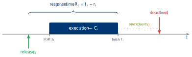
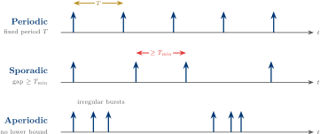
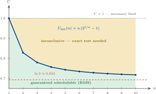

# Real-Time Operating Systems

## Week 2 — The Task Model & the Utilization Bound

Job parameters · periodic / aperiodic / sporadic · hyperperiod · the utilization bound

<div class="pt-10 opacity-70 text-sm">
  KMUTNB · Faculty of Engineering · M.Eng. in Electrical & Computer Engineering
</div>

<div class="abs-br m-6 text-xs opacity-50">
  Reading: Laplante Ch. 3 · Liu &amp; Layland (1973)
</div>

<!--
Week 1 set the vocabulary. This week we make it formal: a task set becomes a
list of numbers, and those numbers feed our first real schedulability test —
the Liu & Layland utilization bound. Everything in Module 2 builds on this.
-->

---
layout: two-cols
layoutClass: gap-8
---

# From Week 1 to Week 2

Last week we built the **vocabulary** of real-time systems:

- real-time = **predictable**, not fast
- a **task** recurs; each instance is a **job**
- deadlines are **hard / firm / soft**
- an RTOS is defined by **determinism**

We met the task model **informally** — jobs, deadlines, periods, utilization.

::right::

<div class="mt-14 px-5 py-4 rounded-lg bg-blue-50 dark:bg-blue-900/30 text-sm leading-relaxed">

**This week — make it formal.**

A schedulability *proof* needs **numbers**. So we:

- pin down every **job and task parameter**
- define the **timing metrics** that decide correctness
- compute the **hyperperiod**
- derive our **first schedulability test** — the utilization bound

<div class="mt-3 opacity-80">
By the end you can look at a task set and say <b>"provably schedulable"</b> — sometimes.
</div>

</div>

---

# Week 2 — Learning Objectives

By the end of this lecture you will be able to:

<v-clicks>

- **Specify** a real-time task with its full parameter set — phase, period, WCET, deadline.
- **Distinguish** BCET, ACET, and WCET, and explain why analysis uses **WCET**.
- **Compute** response time, lateness, tardiness, and laxity for a job.
- **Classify** recurrence as **periodic, aperiodic, or sporadic**, and explain the role of minimum inter-arrival time.
- **Calculate** the **hyperperiod** of a task set and explain why it bounds analysis.
- **Apply** the **Liu &amp; Layland utilization bound** as a sufficient schedulability test.

</v-clicks>

<div v-click class="mt-8 px-4 py-2 border-l-4 border-amber-500 bg-amber-50 dark:bg-amber-900/20 text-sm">
Maps to <b>CLO 1</b> — <i>Explain the theoretical foundations of real-time scheduling and perform schedulability analysis.</i>
</div>

---
layout: section
---

# Part 1
## The Task Model — A Timing Contract

---
layout: statement
---

# Why Model Time Formally?

You cannot **prove** what you cannot **count**.

<div class="mt-8 text-base opacity-80 max-w-2xl mx-auto">
The task model turns "the system feels responsive" into a finite set of
<b>numbers</b> — and a schedulability test is just arithmetic on those numbers.
</div>

---
layout: two-cols
layoutClass: gap-6
---

# Task vs. Job — Precisely

A **task** $\tau_i$ is a recurring computation. Each release is a **job** $J_{i,j}$.

- The **task** is the *template* — fixed parameters.
- A **job** is one *instance* — it has a release, runs, and finishes.
- Schedulability is a statement about **every job, forever**.

<div class="mt-4 text-sm opacity-75">
The task is what you <b>declare</b>; the jobs are what the CPU actually <b>runs</b>.
</div>

::right::

<div class="mt-6 flex justify-center">

</div>

<div class="mt-2 text-xs opacity-70 text-center">
One job: released, waits, executes for Cᵢ, finishes — response time Rᵢ.
</div>

---

# Job Parameters in Full

For job $J_{i,j}$ — the $j$-th job of task $\tau_i$:

<div class="mt-3 text-sm">

| Symbol | Name | Meaning |
|--------|------|---------|
| $r_{i,j}$ | release time | the job becomes **ready** to run |
| $s_{i,j}$ | start time | the job **first** gets the CPU |
| $f_{i,j}$ | finish (completion) time | the job **produces its result** |
| $d_{i,j}$ | absolute deadline | the **wall-clock** instant it must finish by |
| $D_i$ | relative deadline | deadline **measured from release** |

</div>

<div v-click class="mt-5 text-center text-lg px-4 py-2 rounded bg-blue-50 dark:bg-blue-900/30">

$$ d_{i,j} \;=\; r_{i,j} + D_i $$

</div>

<div v-click class="mt-3 text-sm text-center opacity-75">
The <b>relative</b> deadline is a task property; the <b>absolute</b> deadline is a per-job instant.
</div>

---

# Execution Time — Not One Number

How long a job runs **varies** run to run — input data, cache state, branches:

<div class="grid grid-cols-3 gap-4 mt-6 text-sm">

<div class="px-4 py-4 rounded-lg bg-gray-100 dark:bg-gray-800">
<div class="text-base font-bold">BCET</div>
<div class="mt-2">Best-case execution time — the <b>fastest</b> the job ever runs.</div>
<div class="mt-2 text-xs opacity-70">Rarely useful for safety.</div>
</div>

<div class="px-4 py-4 rounded-lg bg-gray-100 dark:bg-gray-800">
<div class="text-base font-bold">ACET</div>
<div class="mt-2">Average-case execution time — the <b>typical</b> run.</div>
<div class="mt-2 text-xs opacity-70">What a GPOS optimises.</div>
</div>

<div class="px-4 py-4 rounded-lg bg-blue-100 dark:bg-blue-900/40">
<div class="text-base font-bold text-blue-900 dark:text-blue-200">WCET — Cᵢ</div>
<div class="mt-2">Worst-case execution time — a <b>safe upper bound</b>.</div>
<div class="mt-2 text-xs opacity-70">Every proof in this course uses this.</div>
</div>

</div>

<div v-click class="mt-6 text-sm px-4 py-2 border-l-4 border-blue-700 bg-blue-50 dark:bg-blue-900/20">
We write Cᵢ for the <b>WCET</b>. Getting a tight, sound Cᵢ is genuinely hard —
that is the entire subject of <b>Week 9</b>. For now we assume it is given.
</div>

---
layout: section
---

# Part 2
## Timing Metrics — What "Correct" Means

---

# Response Time, Lateness, Tardiness

Three quantities derived from a job's release and finish:

<div class="grid grid-cols-3 gap-4 mt-6 text-sm">

<div class="px-4 py-4 rounded-lg bg-blue-50 dark:bg-blue-900/30">
<div class="text-base font-bold text-blue-800 dark:text-blue-300">Response time</div>

<div class="text-center mt-2">

$R_{i,j} = f_{i,j} - r_{i,j}$

</div>

<div class="mt-2 opacity-80">Release to finish. The <b>worst-case</b> Rᵢ over all jobs is what we test.</div>
</div>

<div class="px-4 py-4 rounded-lg bg-amber-50 dark:bg-amber-900/30">
<div class="text-base font-bold text-amber-700 dark:text-amber-300">Lateness</div>

<div class="text-center mt-2">

$L_{i,j} = f_{i,j} - d_{i,j}$

</div>

<div class="mt-2 opacity-80"><b>Negative</b> = finished early. <b>Positive</b> = missed the deadline.</div>
</div>

<div class="px-4 py-4 rounded-lg bg-rose-50 dark:bg-rose-900/30">
<div class="text-base font-bold text-rose-700 dark:text-rose-300">Tardiness</div>

<div class="text-center mt-2">

$\max(0,\; L_{i,j})$

</div>

<div class="mt-2 opacity-80">How <b>badly</b> a job overran — zero if it met the deadline.</div>
</div>

</div>

<div v-click class="mt-6 text-sm text-center px-4 py-2 rounded bg-gray-100 dark:bg-gray-800">
Lateness can be negative; <b>tardiness cannot</b>. Tardiness drives the cost model for <b>soft</b> and <b>firm</b> tasks.
</div>

---

# Slack, Laxity, and Schedulability

<div class="grid grid-cols-2 gap-6 mt-4">

<div>

### Laxity (slack)

At time $t$, with $c(t)$ execution still remaining:

$$ \ell_i(t) \;=\; d_{i,j} - t - c(t) $$

The time a job can **afford to wait** and still meet its deadline.

- Initial laxity $= D_i - C_i$
- $\ell_i(t) = 0$ → it **must run continuously now**
- $\ell_i(t) < 0$ → the deadline is **already lost**

</div>

<div>

### Schedulable — the definition

A task set is **schedulable** under an algorithm if, for **every job of every task**:

$$ R_{i,j} \le D_i \quad\Longleftrightarrow\quad L_{i,j} \le 0 $$

<div class="mt-3 px-4 py-2 rounded bg-blue-50 dark:bg-blue-900/30 text-sm">
Equivalently: <b>maximum tardiness is zero</b>. One miss, ever, and the set
is not schedulable.
</div>

</div>

</div>

<div v-click class="mt-5 text-sm px-4 py-2 border-l-4 border-amber-500 bg-amber-50 dark:bg-amber-900/20">
Least-Laxity-First scheduling uses ℓᵢ(t) directly as the priority — we revisit it in Module 2.
</div>

---
layout: section
---

# Part 3
## Recurrence — Periodic, Aperiodic, Sporadic

---
layout: two-cols
layoutClass: gap-6
---

# The Periodic Task Tuple

A periodic task is fully described by four numbers:

$$ \tau_i \;=\; (\,\Phi_i,\; T_i,\; C_i,\; D_i\,) $$

| Symbol | Parameter |
|--------|-----------|
| $\Phi_i$ | **phase** — offset of the first release |
| $T_i$ | **period** — time between releases |
| $C_i$ | **WCET** — worst-case execution time |
| $D_i$ | **relative deadline** |

::right::

<div class="mt-10 px-5 py-4 rounded-lg bg-blue-50 dark:bg-blue-900/30 text-sm leading-relaxed">

The $j$-th job is then released at

$$ r_{i,j} \;=\; \Phi_i + (j-1)\,T_i $$

**Synchronous** task set — every $\Phi_i = 0$, so all tasks release together at $t = 0$.

<div class="mt-3 opacity-80">
The synchronous case is not just convenient — Week 3 shows it is the
<b>worst case</b>, which is exactly why we analyse it.
</div>

</div>

---

# Three Recurrence Patterns

<div class="my-5 flex justify-center">

</div>

<div class="grid grid-cols-3 gap-4 text-xs">

<div class="px-3 py-2 rounded bg-blue-50 dark:bg-blue-900/30">
<b>Periodic</b> — released every period <b>T</b>. Fully predictable → analysis is <b>exact</b>.
</div>

<div class="px-3 py-2 rounded bg-amber-50 dark:bg-amber-900/30">
<b>Sporadic</b> — irregular, but never closer than <b>Tₘᵢₙ</b>. Bounded rate → still <b>analysable</b>.
</div>

<div class="px-3 py-2 rounded bg-rose-50 dark:bg-rose-900/30">
<b>Aperiodic</b> — no lower bound on spacing. Demand is <b>unbounded</b> → needs a server.
</div>

</div>

---

# Why $T_{\min}$ Makes Sporadic Tractable

<div class="mt-4 text-lg leading-relaxed">

A **sporadic** task has no period — yet it can still carry a **hard** deadline.

</div>

<div v-click class="mt-6 text-base">

The trick: a guaranteed **minimum inter-arrival time** $T_{\min}$.

</div>

<div v-click class="mt-6 grid grid-cols-2 gap-6 text-sm">

<div class="px-4 py-3 rounded bg-blue-50 dark:bg-blue-900/30">
The worst case for a sporadic task is when it fires <b>as fast as it possibly can</b> —
exactly once every <b>Tₘᵢₙ</b>.
</div>

<div class="px-4 py-3 rounded bg-green-100 dark:bg-green-900/30">
So treat it as a <b>periodic</b> task with <b>Tᵢ = Tₘᵢₙ</b> for analysis. The bound
holds even though real arrivals are irregular.
</div>

</div>

<div v-click class="mt-6 text-sm px-4 py-2 border-l-4 border-rose-500 bg-rose-50 dark:bg-rose-900/20">
An <b>aperiodic</b> task has no such bound — it can in principle arrive infinitely
often. It must be served by a budgeted <b>server</b> (Module 2, Week 5).
</div>

---
layout: two-cols
layoutClass: gap-6
---

# Deadline Models

The relationship between $D_i$ and $T_i$ defines three analysis settings:

<v-clicks>

- **Implicit** — $D_i = T_i$. Each job must finish before the next release. *Most theory assumes this.*
- **Constrained** — $D_i \le T_i$. Tighter than the period.
- **Arbitrary** — $D_i$ may exceed $T_i$; jobs of one task can overlap.

</v-clicks>

::right::

<div class="mt-10 px-5 py-4 rounded-lg bg-blue-50 dark:bg-blue-900/30 text-sm leading-relaxed">

### Release jitter

The **ideal** release is periodic — but a job may become ready up to $J_i$ **late**
(e.g. an event detected by an ISR that then unblocks a task).

<div class="mt-3">
Jitter <b>shrinks</b> the effective deadline: the analysis must use <b>Dᵢ − Jᵢ</b>.
</div>

<div class="mt-3 opacity-80">
A periodic task with low, bounded jitter is the gold standard — and the reason
Week 1 insisted on <code>vTaskDelayUntil</code>.
</div>

</div>

---
layout: section
---

# Part 4
## The Hyperperiod

---

# The Hyperperiod

For a set of periodic tasks, the schedule is **not** infinite to check:

<div class="mt-5 text-center text-xl px-4 py-3 rounded bg-blue-50 dark:bg-blue-900/30">

$$ H \;=\; \operatorname{lcm}(T_1,\, T_2,\, \dots,\, T_n) $$

</div>

<v-clicks>

<div class="mt-6 text-base">

With a **synchronous** release, the schedule **repeats exactly** every $H$.

</div>

<div class="mt-3 text-sm">

So a feasible schedule over $[0, H]$ ⟹ feasible **forever**. The infinite problem becomes **finite**.

</div>

</v-clicks>

<div v-click class="mt-6 text-sm px-4 py-2 border-l-4 border-amber-500 bg-amber-50 dark:bg-amber-900/20">
Co-prime periods make <b>H</b> explode — lcm(5, 7, 9) = 315.
<b>Harmonic</b> period sets (each divides the next) keep <b>H</b> small and the system easy to reason about.
</div>

---

# Hyperperiod — Worked Example

The Week 1 task set, revisited:

<div class="mt-4 text-sm">

| Task | $C_i$ (ms) | $T_i$ (ms) | Jobs per hyperperiod $= H / T_i$ |
|------|-----------|-----------|----------------------------------|
| τ₁ | 1 | 4  | 16 / 4 = **4** |
| τ₂ | 2 | 8  | 16 / 8 = **2** |
| τ₃ | 3 | 16 | 16 / 16 = **1** |

</div>

<div v-click class="mt-4 text-lg text-center">

$$ H = \operatorname{lcm}(4, 8, 16) = \mathbf{16}\ \text{ms} $$

</div>

<div v-click class="mt-4 grid grid-cols-2 gap-4 text-sm">
<div class="px-4 py-2 rounded bg-blue-100 dark:bg-blue-900/30">
These periods are <b>harmonic</b> — 4 | 8 | 16 — so <b>H</b> is just the largest period.
</div>
<div class="px-4 py-2 rounded bg-green-100 dark:bg-green-900/30">
<b>7 jobs</b> in [0, 16) describe the whole schedule. Check those, and you are done.
</div>
</div>

---

# The Critical Instant

<div class="mt-4 text-lg leading-relaxed">

**Liu &amp; Layland's critical-instant theorem** —

a task's job suffers its **worst-case response time** when it is released **at the
same instant** as a job of *every* higher-priority task.

</div>

<div v-click class="mt-6 grid grid-cols-2 gap-6 text-sm">

<div class="px-4 py-3 rounded bg-blue-50 dark:bg-blue-900/30">
The worst case is the <b>synchronous</b> arrival at <b>t = 0</b> — maximum interference,
all at once.
</div>

<div class="px-4 py-3 rounded bg-green-100 dark:bg-green-900/30">
So we never simulate every arrival pattern. Analyse <b>one</b> — the synchronous
one — and the guarantee covers them all.
</div>

</div>

<div v-click class="mt-6 text-sm text-center px-4 py-2 rounded bg-gray-100 dark:bg-gray-800">
This single theorem is what makes fixed-priority schedulability <b>decidable</b> — and it is the engine of <b>Week 3</b>.
</div>

---
layout: section
---

# Part 5
## Processor Utilization & the Utilization Bound

---
layout: two-cols
layoutClass: gap-6
---

# Utilization — The Necessary Condition

Each task **demands** a fraction $C_i / T_i$ of the CPU. The total:

$$ U \;=\; \sum_{i=1}^{n} \frac{C_i}{T_i} $$

<v-clicks>

- $U > 1$ → **infeasible** on one core — no algorithm can help.
- $U \le 1$ → **necessary**, but it does **not** guarantee schedulability.

</v-clicks>

::right::

<div class="mt-10 px-5 py-4 rounded-lg bg-amber-50 dark:bg-amber-900/30 text-sm leading-relaxed">

**Necessary ≠ sufficient.**

$U \le 1$ only says the work *fits* if the CPU could be packed **perfectly**.

A real scheduler cannot always pack perfectly — a high-priority task may force
a lower one to **wait past its deadline** even when idle time exists later.

<div class="mt-3 opacity-80">
We need a test that accounts for the <b>algorithm</b>, not just the totals.
</div>

</div>

---

# Two Sets, Same Utilization

Both task sets below have **exactly $U = 0.9$** — yet they differ:

<div class="grid grid-cols-2 gap-6 mt-5 text-sm">

<div class="px-4 py-3 rounded-lg bg-green-50 dark:bg-green-900/20 border-2 border-green-400">
<div class="font-bold text-green-700 dark:text-green-300">Set A — schedulable</div>
<div class="mt-2">Periods chosen so jobs interleave cleanly; every deadline met under fixed-priority.</div>
</div>

<div class="px-4 py-3 rounded-lg bg-red-50 dark:bg-red-900/20 border-2 border-red-400">
<div class="font-bold text-red-700 dark:text-red-300">Set B — misses a deadline</div>
<div class="mt-2">Same total demand, but interference at the critical instant pushes one job late.</div>
</div>

</div>

<div v-click class="mt-8 text-center text-lg">

Utilization alone <b>cannot</b> tell these apart.<br/>
<span class="text-sm opacity-70">We need a test that knows about the <b>scheduling algorithm</b>.</span>

</div>

---

# The Liu &amp; Layland Utilization Bound

For $n$ independent **periodic** tasks, **implicit deadlines** ($D_i = T_i$),
scheduled by **fixed priority** (Rate Monotonic):

<div class="mt-5 text-center text-xl px-4 py-3 rounded bg-blue-50 dark:bg-blue-900/30">

$$ U \;\le\; U_{\text{lub}}(n) \;=\; n\left(2^{1/n} - 1\right) \;\;\Longrightarrow\;\; \textbf{schedulable} $$

</div>

<div class="grid grid-cols-2 gap-6 mt-5">

<div class="text-sm">

| $n$ | $U_{\text{lub}}(n)$ |
|----|---------------------|
| 1  | 1.000 |
| 2  | 0.828 |
| 3  | 0.780 |
| 4  | 0.757 |
| 5  | 0.743 |
| 10 | 0.718 |
| $\infty$ | **0.693** |

</div>

<div v-click class="text-sm px-4 py-3 rounded-lg bg-blue-50 dark:bg-blue-900/30 leading-relaxed self-center">

As $n \to \infty$ the bound decreases to

$$ \lim_{n\to\infty} n\left(2^{1/n}-1\right) = \ln 2 \approx 0.693 $$

So **any** task set with $U \le 69.3\%$ is schedulable under RMS — **regardless of how many tasks**.

</div>

</div>

---

# The Bound, Visualized

<div class="my-3 flex justify-center">

</div>

<div class="grid grid-cols-3 gap-3 text-xs">

<div>

<b>Green</b> — $U \le U_{\text{lub}}(n)$: the test <b>passes</b>, schedulability guaranteed.

</div>

<div>

<b>Amber</b> — $U_{\text{lub}}(n) < U \le 1$: the test is <b>silent</b> — could go either way.

</div>

<div>

<b>Curve</b> — sinks toward $\ln 2$; more tasks → less guaranteed headroom.

</div>

</div>

---

# Using the Bound — Three Outcomes

The bound is a **sufficient** test. Computing $U$ gives one of three verdicts:

<div class="grid grid-cols-3 gap-4 mt-6 text-sm">

<div class="px-4 py-4 rounded-lg border-2 border-green-400 bg-green-50 dark:bg-green-900/20">
<div class="text-base font-bold text-green-700 dark:text-green-300">

$U \le U_{\text{lub}}(n)$

</div>
<div class="mt-2"><b>Schedulable.</b> Guaranteed under RMS. You are done — no further test needed.</div>
</div>

<div class="px-4 py-4 rounded-lg border-2 border-amber-400 bg-amber-50 dark:bg-amber-900/20">
<div class="text-base font-bold text-amber-700 dark:text-amber-300">

$U_{\text{lub}}(n) < U \le 1$

</div>
<div class="mt-2"><b>Inconclusive.</b> Maybe schedulable, maybe not — apply an <b>exact</b> test (Week 3).</div>
</div>

<div class="px-4 py-4 rounded-lg border-2 border-red-400 bg-red-50 dark:bg-red-900/20">
<div class="text-base font-bold text-red-700 dark:text-red-300">

$U > 1$

</div>
<div class="mt-2"><b>Infeasible.</b> Over-subscribed on one core. Stop — redesign.</div>
</div>

</div>

<div v-click class="mt-6 text-sm px-4 py-2 border-l-4 border-blue-700 bg-blue-50 dark:bg-blue-900/20">
A <b>sufficient</b> test never gives a false "schedulable" — but it may pessimistically
say "inconclusive" for a set that is in fact fine. That gap is why <b>exact</b> tests exist.
</div>

---

# Worked Example — Apply the Bound

<div class="grid grid-cols-2 gap-6 mt-3 text-sm">

<div>

### Set A — the Week 1 task set

| Task | $C_i$ | $T_i$ | $U_i$ |
|------|------|------|-------|
| τ₁ | 1 | 4  | 0.250 |
| τ₂ | 2 | 8  | 0.250 |
| τ₃ | 3 | 16 | 0.188 |

$U = \mathbf{0.688}$, &nbsp; $U_{\text{lub}}(3) = 0.780$

<div v-click class="mt-2 px-3 py-2 rounded bg-green-100 dark:bg-green-900/30">
0.688 ≤ 0.780 → <b>guaranteed schedulable</b> under RMS. ✓
</div>

</div>

<div>

### Set B — a heavier set

| Task | $C_i$ | $T_i$ | $U_i$ |
|------|------|------|-------|
| τ₁ | 2 | 5 | 0.400 |
| τ₂ | 2 | 7 | 0.286 |
| τ₃ | 2 | 9 | 0.222 |

$U = \mathbf{0.908}$, &nbsp; $U_{\text{lub}}(3) = 0.780$

<div v-click class="mt-2 px-3 py-2 rounded bg-amber-100 dark:bg-amber-900/30">
0.780 < 0.908 ≤ 1 → <b>inconclusive</b>. The exact test in Week 3 decides.
</div>

</div>

</div>

<div v-click class="mt-5 text-sm text-center px-4 py-2 rounded bg-gray-100 dark:bg-gray-800">
Week 1 asked "is Set A schedulable?" — today, for the first time, we can answer: <b>provably yes</b>.
</div>

---

# A Glimpse Ahead — EDF

The Liu &amp; Layland bound is **pessimistic** because RMS uses **fixed** priorities.

<div v-click class="mt-6 px-5 py-4 rounded-lg bg-blue-50 dark:bg-blue-900/30 text-sm leading-relaxed">

With **dynamic** priorities — **Earliest Deadline First** — the test becomes exact:

$$ \text{EDF schedulable (implicit deadlines)} \;\Longleftrightarrow\; U \le 1 $$

For EDF, $U \le 1$ is **necessary *and* sufficient** — the full CPU is usable.

</div>

<div v-click class="mt-5 text-sm px-4 py-2 border-l-4 border-amber-500 bg-amber-50 dark:bg-amber-900/20">
So why does industry lean on RMS? Fixed priorities are simpler, cheaper, and degrade
more predictably under overload. <b>RMS vs. EDF</b> is the debate of <b>Week 4</b>.
</div>

---
layout: section
---

# Part 6
## Lab 1 — Hello FreeRTOS

---
layout: two-cols
layoutClass: gap-6
---

# Lab 1 — Hello FreeRTOS

The first lab where the task model **runs on real silicon**.

<v-clicks>

1. Create **two tasks** with `xTaskCreate`
2. Assign them **different priorities**
3. Use `vTaskDelay` to make each task **periodic-ish**
4. Build &amp; flash to the **FRDM-MCXN236**
5. Capture your **first SystemView trace**
6. Identify each task, the **idle task**, and the **tick**

</v-clicks>

::right::

<div class="mt-12 px-5 py-4 rounded-lg bg-amber-50 dark:bg-amber-900/30 text-sm leading-relaxed">

**What you are looking for**

In the SystemView timeline you should *see* the model from today:

- two tasks, each with its own **release rhythm**
- the higher-priority task **preempting** the lower one
- the **idle task** filling the slack — your spare utilization, made visible

<div class="mt-3 text-xs opacity-70">
Reading — Laplante Ch. 3 · Liu &amp; Layland (1973)
</div>

</div>

---

# Lab 1 — The Code

Two periodic tasks at different priorities:

```c {all|1-7|9-15|17-25|all}{maxHeight:'380px'}
void vTaskLED(void *pvParameters)         /* lower priority — runs often */
{
    for (;;)
    {
        gpio_toggle(LED_GREEN);
        vTaskDelay(pdMS_TO_TICKS(500));    /* relative 500 ms delay      */
    }
}

void vTaskPrint(void *pvParameters)        /* higher priority — preempts */
{
    for (;;)
    {
        printf("tick from the priority-2 task\r\n");
        vTaskDelay(pdMS_TO_TICKS(1000));
    }
}

int main(void)
{
    board_init();
    xTaskCreate(vTaskLED,   "led",   256, NULL, /* prio */ 1, NULL);
    xTaskCreate(vTaskPrint, "print", 256, NULL, /* prio */ 2, NULL);
    vTaskStartScheduler();                 /* the scheduler takes over   */
    for (;;) { }                           /* never reached              */
}
```

---

# `vTaskDelay` vs. `vTaskDelayUntil`

The lab starts with `vTaskDelay` — but watch what it does to the **period**:

<div class="grid grid-cols-2 gap-6 mt-4 text-sm">

<div class="px-4 py-3 rounded-lg bg-amber-50 dark:bg-amber-900/30">
<div class="font-bold text-amber-700 dark:text-amber-300"><code>vTaskDelay(n)</code></div>
<div class="mt-2">Blocks for <b>n</b> ticks <b>measured from the call</b>.</div>
<div class="mt-2">Real period = n + work + preemption — so it <b>drifts</b>.</div>
<div class="mt-2 text-xs opacity-70">Fine for "blink an LED", wrong for a control loop.</div>
</div>

<div class="px-4 py-3 rounded-lg bg-green-100 dark:bg-green-900/30">
<div class="font-bold text-green-700 dark:text-green-300"><code>vTaskDelayUntil(&amp;last, n)</code></div>
<div class="mt-2">Wakes at an <b>absolute</b> time — the previous wake plus <b>n</b>.</div>
<div class="mt-2">Period is exactly <b>n</b> — <b>no drift</b>; each release lands on the ideal grid.</div>
<div class="mt-2 text-xs opacity-70">This is the periodic task model, in code.</div>
</div>

</div>

<div v-click class="mt-6 text-sm px-4 py-2 border-l-4 border-blue-700 bg-blue-50 dark:bg-blue-900/20">
Lab task: implement both, then use SystemView to <b>measure the drift</b> of
<code>vTaskDelay</code> — and confirm <code>vTaskDelayUntil</code> removes it.
</div>

---
layout: default
---

# Key Takeaways

<v-clicks>

- A task is a **timing contract** — phase, period, WCET, deadline — and a job is one instance of it.
- Analysis always uses **WCET** ($C_i$): a real-time guarantee is a statement about the **worst case**.
- **Schedulable** means $R_{i,j} \le D_i$ for **every job** — equivalently, **zero tardiness**, forever.
- **Sporadic** tasks are tractable because $T_{\min}$ bounds their demand; **aperiodic** tasks are not.
- The **hyperperiod** $H = \operatorname{lcm}(T_i)$ turns an infinite check into a finite one.
- The **utilization bound** $U \le n(2^{1/n}-1)$ is our first real schedulability test — sufficient, not exact.

</v-clicks>

<div v-click class="mt-6 text-center text-base px-4 py-2 rounded bg-blue-100 dark:bg-blue-900/40">
Next week — <b>Rate Monotonic Scheduling</b>: where these priorities <i>come from</i>,
and the <b>exact</b> test for the amber zone.
</div>

---

# Before Next Week

<div class="grid grid-cols-2 gap-8 mt-6">

<div>

### Reading
- **Laplante**, Ch. 3 — the real-time task model
- **Liu &amp; Layland (1973)** — read §1–3; we prove the bound in Week 3
- Skim: FreeRTOS API for `xTaskCreate`, `vTaskDelay`

### Lab
- Complete **Lab 1 — Hello FreeRTOS**
- Bring a **SystemView trace** showing preemption + the idle task

</div>

<div>

### Check yourself
<div class="text-sm">

1. A job has $r = 10$, $D_i = 8$, $f = 21$. Find its response time, lateness, and tardiness.
2. Why can a **sporadic** task have a hard deadline but a pure **aperiodic** task usually cannot?
3. Compute $H$ for periods $\{10, 15, 20\}$ ms. Compare with $\{10, 16, 25\}$.
4. A 6-task set has $U = 0.71$. Is it RMS-schedulable? Which outcome — and why?

</div>

</div>

</div>

---
layout: end
class: text-center
---

# Week 2 Complete

The Task Model &amp; the Utilization Bound

<div class="mt-4 text-sm opacity-70">
Real-Time Operating Systems · KMUTNB · M.Eng. ECE<br/>
Next — Week 3 · Rate Monotonic Scheduling &amp; the Liu &amp; Layland Theorem
</div>

<style>
:root {
  --slidev-theme-primary: #003874;
}
.slidev-layout h1 {
  color: #003874;
}
.dark .slidev-layout h1 {
  color: #7ba7d9;
}
table {
  font-size: 0.92em;
}
</style>
