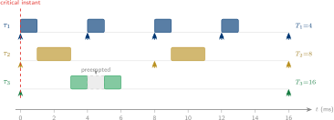

# Real-Time Operating Systems

## Week 3 — Rate Monotonic Scheduling

Priority assignment · optimality · critical instant · response-time analysis

<div class="pt-10 opacity-70 text-sm">
  KMUTNB · Faculty of Engineering · M.Eng. in Electrical & Computer Engineering
</div>

<div class="abs-br m-6 text-xs opacity-50">
  Reading: Laplante Ch. 5 · Liu &amp; Layland (1973)
</div>

<!--
Week 2 gave us the formal task model and a sufficient schedulability test.
This week we answer the question that test left open: where do priorities
come from, and when is "inconclusive" actually fine?  The rate-monotonic
assignment rule and the response-time recurrence resolve both.
-->

---
layout: two-cols
layoutClass: gap-8
---

# From Week 2 to Week 3

Last week we **formalised** the task model:

- task tuple $(\Phi_i, T_i, C_i, D_i)$
- hyperperiod $H = \operatorname{lcm}(T_i)$
- utilization bound $U \le n(2^{1/n}-1)$ → sufficient
- **Set B** was left as **inconclusive** (U = 0.908 > $U_{\text{lub}}$)

::right::

<div class="mt-10 px-5 py-4 rounded-lg bg-blue-50 dark:bg-blue-900/30 text-sm leading-relaxed">

**This week — make the priorities optimal and the test exact.**

- *Where* do fixed priorities come from? → **Rate Monotonic** rule
- *Why* is that rule optimal? → **Liu &amp; Layland Theorem 1**
- *How* do we test the amber zone? → **Response-Time Analysis**
- *What* does the schedule actually look like? → **Gantt + critical instant**

<div class="mt-3 opacity-80">
By the end you can fully analyse Set B and say <b>schedulable</b> or <b>infeasible</b>.
</div>

</div>

---

# Week 3 — Learning Objectives

By the end of this lecture you will be able to:

<v-clicks>

- **State** the Rate Monotonic priority assignment rule and apply it to any task set.
- **Explain** why RMS is optimal among all fixed-priority algorithms (exchange argument).
- **Identify** the critical instant and use it to bound response-time analysis.
- **Execute** the response-time analysis (RTA) recurrence to compute worst-case response times.
- **Apply** the full three-level test hierarchy: infeasibility → utilization bound → RTA.
- **Resolve** the Week 2 "inconclusive" result for Set B.

</v-clicks>

<div v-click class="mt-8 px-4 py-2 border-l-4 border-amber-500 bg-amber-50 dark:bg-amber-900/20 text-sm">
Maps to <b>CLO 1</b> — <i>Explain the theoretical foundations of real-time scheduling and perform schedulability analysis.</i>
</div>

---
layout: section
---

# Part 1
## Priority Assignment — Where Do Priorities Come From?

---
layout: statement
---

# The Scheduling Problem

Given $n$ tasks that compete for one CPU, **which task runs next?**

<div class="mt-8 text-base opacity-80 max-w-2xl mx-auto">
The answer is a <b>scheduling algorithm</b>. For fixed-priority systems, the
algorithm is simple: always run the <b>highest-priority ready task</b>. The
hard question is: <b>how should priorities be assigned?</b>
</div>

---
layout: two-cols
layoutClass: gap-6
---

# Fixed vs. Dynamic Priority

Two broad families of priority assignment:

<div class="mt-4 text-sm">

| Property | Fixed priority | Dynamic priority |
|----------|---------------|-----------------|
| Priority assigned | at **task creation** | at **each job release** |
| Changes at runtime | never | every period |
| Example algorithms | **RMS**, DMS | **EDF**, LLF |
| Optimality (implicit $D_i = T_i$) | RMS optimal | EDF optimal |
| Overhead | very low | moderate |
| Overload behaviour | graceful | can cascade |

</div>

::right::

<div class="mt-8 px-5 py-4 rounded-lg bg-blue-50 dark:bg-blue-900/30 text-sm leading-relaxed">

**Fixed priority** is the dominant choice in safety-critical systems: AUTOSAR, ARINC 653, DO-178C, IEC 61508 all specify or assume it.

<div class="mt-3 opacity-80">
The reason is predictability under overload — if a task is overloaded, <b>only lower-priority tasks</b> suffer. With dynamic priority the damage propagates unpredictably.
</div>

</div>

---

# The Rate Monotonic Rule

**Rate Monotonic Scheduling (RMS):** assign priority **proportional to frequency** — shorter period = higher priority.

<div class="mt-5 text-center text-xl px-4 py-3 rounded bg-blue-50 dark:bg-blue-900/30">

$$ T_i < T_j \;\Longrightarrow\; \pi_i > \pi_j $$

</div>

<v-clicks>

<div class="mt-5 grid grid-cols-2 gap-6 text-sm">

<div class="px-4 py-3 rounded-lg bg-green-50 dark:bg-green-900/20">
<div class="font-bold text-green-700 dark:text-green-300">Intuition</div>
<div class="mt-2">A fast task is "urgent" more often. Giving it priority ensures it never waits long enough to miss its deadline.</div>
</div>

<div class="px-4 py-3 rounded-lg bg-blue-50 dark:bg-blue-900/30">
<div class="font-bold text-blue-700 dark:text-blue-300">Implicit deadlines assumed</div>
<div class="mt-2">The rule is optimal only when $D_i = T_i$. With constrained deadlines, <b>Deadline Monotonic</b> (DMS, $D_i < D_j \Rightarrow \pi_i > \pi_j$) takes over.</div>
</div>

</div>

</v-clicks>

<div v-click class="mt-5 text-sm px-4 py-2 border-l-4 border-amber-500 bg-amber-50 dark:bg-amber-900/20">
Ties in period → equal deadline under implicit model → either assignment works; break ties arbitrarily.
</div>

---

# RMS on the Running Example

The Week 1–2 task set, priorities assigned by RMS:

<div class="mt-4 text-sm">

| Task | $C_i$ (ms) | $T_i$ (ms) | RMS priority | $U_i$ |
|------|-----------|-----------|-------------|-------|
| $\tau_1$ | 1 | 4  | **highest** (fastest) | 0.250 |
| $\tau_2$ | 2 | 8  | **middle** | 0.250 |
| $\tau_3$ | 3 | 16 | **lowest** (slowest) | 0.188 |

</div>

<div v-click class="mt-4 grid grid-cols-2 gap-4 text-sm">
<div class="px-4 py-2 rounded bg-green-100 dark:bg-green-900/30">
$U = 0.688 \le U_{\text{lub}}(3) = 0.780$ → <b>already guaranteed schedulable</b>
</div>
<div class="px-4 py-2 rounded bg-blue-50 dark:bg-blue-900/30">
We will <b>verify</b> this with RTA shortly — and see the Gantt first.
</div>
</div>

---
layout: section
---

# Part 2
## Liu &amp; Layland Theorem 1 — RMS is Optimal

---
layout: statement
---

# Rate Monotonic is Optimal

If any fixed-priority algorithm can schedule a task set,<br/>
then **Rate Monotonic** can also schedule it.

<div class="mt-8 text-sm opacity-80 max-w-2xl mx-auto">
Liu &amp; Layland (1973), Theorem 1. The proof uses an exchange argument —
we show that any "wrong" priority assignment can be improved by
swapping adjacent priorities until it matches RMS, without causing any new misses.
</div>

---
layout: two-cols
layoutClass: gap-6
---

# The Exchange Argument

Consider two adjacent tasks $\tau_a$ (higher priority) and $\tau_b$ (lower priority) where $T_a > T_b$ — a **non-RM** assignment.

**Claim:** swapping their priorities cannot cause $\tau_b$ to miss.

<v-clicks>

1. Before the swap: $\tau_a$ preempts $\tau_b$ repeatedly — $\tau_b$ may be tight.
2. After the swap ($\tau_b$ runs first): $\tau_b$ now runs whenever it needs to, so it **cannot be worse off**.
3. $\tau_a$ now sometimes waits for $\tau_b$ — but $\tau_a$ has a longer period, so it has more slack to absorb that wait.

</v-clicks>

::right::

<div class="mt-12 px-5 py-4 rounded-lg bg-blue-50 dark:bg-blue-900/30 text-sm leading-relaxed">

Repeating this swap until all adjacent pairs are in RM order gives a **valid RM assignment** that is at least as schedulable as the original.

<div class="mt-3 opacity-80">
The argument is a classic <b>exchange / bubble-sort proof</b>. It shows a
property — not just for two tasks, but for the whole ordering.
</div>

<div class="mt-3 text-xs opacity-60">
Liu, C.L. &amp; Layland, J.W. (1973). Scheduling algorithms for multiprogramming
in a hard-real-time environment. <i>JACM 20(1)</i>, 46–61.
</div>

</div>

---

# What Optimality Guarantees — and What It Doesn't

<div class="mt-4 grid grid-cols-2 gap-6 text-sm">

<div class="px-4 py-4 rounded-lg border-2 border-green-400 bg-green-50 dark:bg-green-900/20">
<div class="text-base font-bold text-green-700 dark:text-green-300">What it means</div>
<div class="mt-2">If <b>any</b> fixed-priority assignment can schedule a task set, <b>RMS can</b>. You never lose by using RMS.</div>
</div>

<div class="px-4 py-4 rounded-lg border-2 border-amber-400 bg-amber-50 dark:bg-amber-900/20">
<div class="text-base font-bold text-amber-700 dark:text-amber-300">What it doesn't mean</div>
<div class="mt-2">RMS is NOT optimal among all algorithms. <b>EDF</b> (dynamic priority) can schedule task sets that RMS cannot — specifically when $U > U_{\text{lub}}$.</div>
</div>

</div>

<div v-click class="mt-6 text-sm px-4 py-2 border-l-4 border-blue-700 bg-blue-50 dark:bg-blue-900/20">
Optimality here is <b>within the fixed-priority class</b>. When the choice is "which fixed-priority assignment?", RMS wins every time.
</div>

---
layout: section
---

# Part 3
## The Critical Instant &amp; The RMS Schedule

---

# Critical Instant Theorem

<div class="mt-4 text-lg leading-relaxed">

**Liu &amp; Layland's critical-instant theorem** —

The worst-case response time of task $\tau_i$ occurs when $\tau_i$ and **every higher-priority task** release a job **simultaneously**.

</div>

<div v-click class="mt-5 grid grid-cols-2 gap-6 text-sm">

<div class="px-4 py-3 rounded bg-blue-50 dark:bg-blue-900/30">
This simultaneous release is the <b>critical instant</b>. It maximises the
interference that higher-priority tasks impose on $\tau_i$.
</div>

<div class="px-4 py-3 rounded bg-green-100 dark:bg-green-900/30">
For a synchronous task set ($\Phi_i = 0$ for all $i$) the critical instant
happens naturally at $t = 0$ — so we analyse the start of the hyperperiod.
</div>

</div>

<div v-click class="mt-5 text-sm px-4 py-2 border-l-4 border-amber-500 bg-amber-50 dark:bg-amber-900/20">
One consequence: if the system is schedulable at $t = 0$, it is schedulable <b>forever</b>.
We never need to simulate beyond one hyperperiod.
</div>

---

# The RMS Gantt Chart

<div class="my-3 flex justify-center">

</div>

<div class="grid grid-cols-3 gap-3 text-xs mt-1">

<div class="px-3 py-2 rounded bg-blue-50 dark:bg-blue-900/30">
<b>τ₁</b> runs at every period: [0,1] [4,5] [8,9] [12,13] — four jobs in H=16 ms.
</div>

<div class="px-3 py-2 rounded bg-amber-50 dark:bg-amber-900/30">
<b>τ₂</b> fits between τ₁ jobs: [1,3] [9,11] — two jobs, each 2 ms.
</div>

<div class="px-3 py-2 rounded bg-green-50 dark:bg-green-900/30">
<b>τ₃</b> is <b>preempted</b> at t=4 by τ₁, resumes at t=5, finishes at t=6 — one job, meets D₃=16.
</div>

</div>

---

# Reading the Gantt — Key Observations

<v-clicks>

- **Preemption is correct behaviour** — τ₁ at t=4 takes the CPU from τ₃, which is *lower* priority. This is exactly what the algorithm should do.

- **All deadlines are met**: τ₁ finishes each job at 1, 5, 9, 13 — all before the next release at 4, 8, 12, 16. τ₂ finishes at 3 and 11 — both before d=8 and d=16. τ₃ finishes at 6 — well before d=16.

- **Idle time exists** at [6,8], [11,12], [13,16] — the CPU is genuinely free. This is the "spare utilization" visible in SystemView.

- **The critical instant at t=0** is where all three tasks start together — exactly the configuration the theorem says produces worst-case response times.

</v-clicks>

<div v-click class="mt-4 text-sm px-4 py-2 border-l-4 border-blue-700 bg-blue-50 dark:bg-blue-900/20">
Worst-case response times: R₁ = 1 ms, R₂ = 3 ms, R₃ = 6 ms (includes 1 ms preemption).
All ≤ their deadlines (4, 8, 16). Confirmed schedulable.
</div>

---
layout: section
---

# Part 4
## Response-Time Analysis — The Exact Test

---

# Motivation — Resolving the Amber Zone

The utilization bound left **Set B inconclusive**: $U = 0.908 > U_{\text{lub}}(3) = 0.780$.

<div class="mt-5 grid grid-cols-3 gap-4 text-sm">

<div class="px-4 py-3 rounded-lg border-2 border-green-400 bg-green-50 dark:bg-green-900/20">
<div class="font-bold text-green-700 dark:text-green-300">$U \le U_{\text{lub}}(n)$</div>
<div class="mt-1">Sufficient → <b>done</b></div>
</div>

<div class="px-4 py-3 rounded-lg border-2 border-amber-400 bg-amber-50 dark:bg-amber-900/20">
<div class="font-bold text-amber-700 dark:text-amber-300">$U_{\text{lub}} < U \le 1$</div>
<div class="mt-1">Inconclusive → apply <b>RTA</b></div>
</div>

<div class="px-4 py-3 rounded-lg border-2 border-red-400 bg-red-50 dark:bg-red-900/20">
<div class="font-bold text-red-700 dark:text-red-300">$U > 1$</div>
<div class="mt-1">Infeasible → <b>stop</b></div>
</div>

</div>

<div v-click class="mt-6 text-sm px-4 py-2 border-l-4 border-blue-700 bg-blue-50 dark:bg-blue-900/20">
Response-Time Analysis (Joseph &amp; Pandya, 1986) computes the <b>worst-case response time</b>
$R_i$ of each task exactly, by accounting for interference from all higher-priority tasks.
</div>

---

# The RTA Recurrence

For task $\tau_i$ with higher-priority tasks $\text{hp}(i)$, iterate:

<div class="mt-5 text-center text-lg px-4 py-3 rounded bg-blue-50 dark:bg-blue-900/30">

$$ R_i^{(k+1)} \;=\; C_i \;+\; \sum_{j\,\in\,\text{hp}(i)} \left\lceil \frac{R_i^{(k)}}{T_j} \right\rceil C_j $$

</div>

<v-clicks>

<div class="mt-5 grid grid-cols-2 gap-6 text-sm">

<div class="px-4 py-3 rounded bg-blue-50 dark:bg-blue-900/30">
<div class="font-bold">The ceiling term</div>
<div class="mt-2">$\lceil R_i^{(k)} / T_j \rceil$ counts how many times task τⱼ can <b>preempt</b> τᵢ during a window of length $R_i^{(k)}$. Each preemption costs $C_j$.</div>
</div>

<div class="px-4 py-3 rounded bg-blue-50 dark:bg-blue-900/30">
<div class="font-bold">Convergence</div>
<div class="mt-2">Start with $R_i^{(0)} = C_i$. Iterate until $R_i^{(k+1)} = R_i^{(k)}$ — <b>converged</b>. If $R_i^{(k+1)} > D_i$ before convergence — <b>infeasible</b>.</div>
</div>

</div>

</v-clicks>

<div v-click class="mt-4 text-sm px-4 py-2 border-l-4 border-amber-500 bg-amber-50 dark:bg-amber-900/20">
The recurrence always converges if the task set is schedulable, and diverges past $D_i$ if it is not.
The sequence is monotonically non-decreasing.
</div>

---

# RTA — Worked Example: Set A

Task set: τ₁(C=1, T=4), τ₂(C=2, T=8), τ₃(C=3, T=16) — priorities τ₁ > τ₂ > τ₃

<div class="mt-4 text-sm">

**τ₁** — no higher-priority tasks, so $R_1 = C_1 = 1$ ms. Check: $1 \le D_1 = 4$. ✓

**τ₂** — $\text{hp}(2) = \{\tau_1\}$

$$R_2^{(0)} = 2, \quad R_2^{(1)} = 2 + \left\lceil\tfrac{2}{4}\right\rceil \cdot 1 = 2 + 1 = 3, \quad R_2^{(2)} = 2 + \left\lceil\tfrac{3}{4}\right\rceil \cdot 1 = 2 + 1 = 3 \quad \checkmark$$

Check: $R_2 = 3 \le D_2 = 8$. ✓

**τ₃** — $\text{hp}(3) = \{\tau_1, \tau_2\}$

$$R_3^{(0)} = 3, \quad R_3^{(1)} = 3 + \left\lceil\tfrac{3}{4}\right\rceil{\cdot}1 + \left\lceil\tfrac{3}{8}\right\rceil{\cdot}2 = 3+1+2 = 6$$

$$R_3^{(2)} = 3 + \left\lceil\tfrac{6}{4}\right\rceil{\cdot}1 + \left\lceil\tfrac{6}{8}\right\rceil{\cdot}2 = 3+2+2 = 7 \;\longrightarrow\; R_3^{(3)} = 3+2+2 = 7 \quad \checkmark$$

Check: $R_3 = 7 \le D_3 = 16$. ✓

</div>

<div v-click class="mt-3 px-3 py-2 rounded bg-green-100 dark:bg-green-900/30 text-sm text-center">
Set A is <b>confirmed schedulable</b>. Worst-case response times: 1 ms · 3 ms · 7 ms.
</div>

---

# RTA — Set B: The Amber Zone Resolved

Task set (Set B): τ₁(C=2, T=5), τ₂(C=2, T=7), τ₃(C=2, T=9) — U = 0.908, inconclusive

<div class="mt-4 text-sm">

**τ₁**: $R_1 = C_1 = 2 \le D_1 = 5$. ✓

**τ₂** — $\text{hp}(2) = \{\tau_1\}$

$$R_2^{(0)} = 2, \quad R_2^{(1)} = 2 + \left\lceil\tfrac{2}{5}\right\rceil{\cdot}2 = 2+2 = 4, \quad R_2^{(2)} = 2 + \left\lceil\tfrac{4}{5}\right\rceil{\cdot}2 = 2+2 = 4 \quad \checkmark$$

Check: $R_2 = 4 \le D_2 = 7$. ✓

**τ₃** — $\text{hp}(3) = \{\tau_1, \tau_2\}$

</div>

<div class="mt-3 text-sm">

| Iter | $R_3^{(k)}$ | $\lceil R/5 \rceil \cdot 2$ | $\lceil R/7 \rceil \cdot 2$ | $R_3^{(k+1)}$ |
|------|------------|------------|------------|------------|
| 0 | 2 | 1×2 = 2 | 1×2 = 2 | **6** |
| 1 | 6 | 2×2 = 4 | 1×2 = 2 | **8** |
| 2 | 8 | 2×2 = 4 | 2×2 = 4 | **10** |
| 3 | 10 | 2×2 = 4 | 2×2 = 4 | **10** ← converged |

</div>

<div v-click class="mt-3 px-3 py-2 rounded bg-red-100 dark:bg-red-900/30 text-sm text-center">
$R_3 = 10 > D_3 = 9$ → τ₃ <b>misses its deadline</b>. Set B is <b>not schedulable</b> under RMS.
</div>

---
layout: section
---

# Part 5
## The Three-Level Test Hierarchy

---

# Test Hierarchy

Three schedulability tests, in order of cost and precision:

<div class="grid grid-cols-3 gap-4 mt-5 text-sm">

<div class="px-4 py-4 rounded-lg border-2 border-red-400 bg-red-50 dark:bg-red-900/20">
<div class="text-base font-bold text-red-700 dark:text-red-300">Level 1 — Infeasibility</div>
<div class="mt-2">

$U > 1$ → STOP. No algorithm, not even EDF, can schedule this on one core.

</div>
<div class="mt-2 text-xs opacity-70">Cost: one sum. Definitive.</div>
</div>

<div class="px-4 py-4 rounded-lg border-2 border-green-400 bg-green-50 dark:bg-green-900/20">
<div class="text-base font-bold text-green-700 dark:text-green-300">Level 2 — Utilization Bound</div>
<div class="mt-2">

$U \le U_{\text{lub}}(n)$ → DONE. Sufficient test — schedulable under RMS, no further analysis.

</div>
<div class="mt-2 text-xs opacity-70">Cost: one compare. Optimistic gateway.</div>
</div>

<div class="px-4 py-4 rounded-lg border-2 border-blue-400 bg-blue-50 dark:bg-blue-900/20">
<div class="text-base font-bold text-blue-700 dark:text-blue-300">Level 3 — RTA</div>
<div class="mt-2">

$U_{\text{lub}} < U \le 1$ → run RTA. Exact test — computes $R_i$ for each task.

</div>
<div class="mt-2 text-xs opacity-70">Cost: iterative. Precise for RMS.</div>
</div>

</div>

<div v-click class="mt-5 text-sm px-4 py-2 border-l-4 border-blue-700 bg-blue-50 dark:bg-blue-900/20">
Always check in order 1 → 2 → 3. Most task sets never reach Level 3 — good design keeps U well below $\ln 2 \approx 0.693$.
</div>

---

# Set B — Full Analysis Summary

<div class="mt-4 text-sm">

| Task | Cᵢ | Tᵢ | Uᵢ | Priority | Rᵢ (RTA) | Dᵢ | Result |
|------|---|---|---|---------|---------|---|--------|
| τ₁ | 2 | 5 | 0.400 | 1 (highest) | **2** | 5 | ✓ |
| τ₂ | 2 | 7 | 0.286 | 2 | **4** | 7 | ✓ |
| τ₃ | 2 | 9 | 0.222 | 3 (lowest) | **10** | 9 | ✗ MISS |

</div>

<div v-click class="mt-5 grid grid-cols-2 gap-4 text-sm">

<div class="px-4 py-3 rounded bg-red-50 dark:bg-red-900/20">
<div class="font-bold">Verdict</div>
<div class="mt-1">Set B is <b>not schedulable</b> under RMS. τ₃ requires 10 ms of response time but only has 9 ms until its deadline.</div>
</div>

<div class="px-4 py-3 rounded bg-amber-50 dark:bg-amber-900/30">
<div class="font-bold">Possible remedies</div>
<div class="mt-1">
Reduce τ₃'s WCET · relax τ₃'s deadline · lengthen τ₁/τ₂ periods · move to EDF (Week 4 shows EDF can schedule U ≤ 1)
</div>
</div>

</div>

---
layout: section
---

# Part 6
## Lab 2 — Observing Fixed-Priority Preemption

---
layout: two-cols
layoutClass: gap-6
---

# Lab 2 — Fixed-Priority Preemption

Apply this week's theory on real silicon.

<v-clicks>

1. **Assign RMS priorities** to the two tasks from Lab 1
2. Add a **third task** at lower priority (long computation, T=200 ms)
3. Record a **SystemView trace** over at least one hyperperiod
4. **Identify every preemption event** — which task was interrupted, which caused it
5. **Measure** τ₃'s worst-case response time from the trace
6. **Predict** it with the RTA recurrence — compare

</v-clicks>

::right::

<div class="mt-10 px-5 py-4 rounded-lg bg-amber-50 dark:bg-amber-900/30 text-sm leading-relaxed">

**What theory predicts**

The RTA for this lab's three-task set gives worst-case response times you can verify in SystemView — to within one tick resolution.

<div class="mt-3">
If your measured maximum ≤ your RTA prediction, the system is behaving as the model says.
If it <b>exceeds</b> the RTA result: dig into ISR overhead and tick granularity.
</div>

<div class="mt-3 text-xs opacity-70">
Reading — Laplante Ch. 5 · Liu &amp; Layland §3
</div>

</div>

---

# Lab 2 — Priority Assignment in FreeRTOS

FreeRTOS priority: **higher number = higher priority**. Map the RMS order directly:

```c {all|1-6|8-13|15-20|all}{maxHeight:'340px'}
/* Task parameters — chosen to satisfy RMS (T1 < T2 < T3) */
#define T1_MS   50U   /* fastest  → highest RMS priority */
#define T2_MS  100U
#define T3_MS  200U   /* slowest  → lowest  RMS priority */

#define STACK  256U

void vTask1(void *p)   /* tau_1: C≈3 ms measured */
{
    TickType_t xLast = xTaskGetTickCount();
    for (;;) {
        /* … work … */
        vTaskDelayUntil(&xLast, pdMS_TO_TICKS(T1_MS));
    }
}

/* identical bodies for vTask2, vTask3 */

int main(void)
{
    xTaskCreate(vTask1, "t1", STACK, NULL, /* prio */ 3, NULL);
    xTaskCreate(vTask2, "t2", STACK, NULL, /* prio */ 2, NULL);
    xTaskCreate(vTask3, "t3", STACK, NULL, /* prio */ 1, NULL);
    vTaskStartScheduler();
}
```

---

# Lab 2 — What to Observe in SystemView

Three things to verify against the theory:

<v-clicks>

<div class="mt-3 grid grid-cols-3 gap-4 text-sm">

<div class="px-4 py-3 rounded-lg bg-blue-50 dark:bg-blue-900/30">
<div class="font-bold text-blue-700 dark:text-blue-300">1. Preemption pattern</div>
<div class="mt-2">Every τ₁ release should preempt τ₂ or τ₃. τ₂ releases should preempt only τ₃. Confirm the priority order is active.</div>
</div>

<div class="px-4 py-3 rounded-lg bg-amber-50 dark:bg-amber-900/30">
<div class="font-bold text-amber-700 dark:text-amber-300">2. τ₃'s worst case</div>
<div class="mt-2">Find the longest elapsed time from τ₃'s release to its completion. Compare with your RTA result.</div>
</div>

<div class="px-4 py-3 rounded-lg bg-green-50 dark:bg-green-900/30">
<div class="font-bold text-green-700 dark:text-green-300">3. Idle task</div>
<div class="mt-2">Quantify the fraction of time the idle task runs. This is $1 - U$ made visible — does it match $1 - \sum C_i/T_i$?</div>
</div>

</div>

</v-clicks>

---
layout: default
---

# Key Takeaways

<v-clicks>

- **Rate Monotonic** assigns priority by rate: shortest period = highest priority. It is the **optimal fixed-priority** assignment.
- **Optimality** is within the fixed-priority class — EDF can still outperform RMS.
- The **critical instant** (simultaneous release of all tasks) produces the **worst-case response time** for every task. Analyse $t = 0$ only.
- **Response-Time Analysis** iterates $R_i^{(k+1)} = C_i + \sum_{j \in \text{hp}(i)} \lceil R_i^{(k)}/T_j \rceil C_j$ until convergence or $R_i > D_i$.
- The **three-level hierarchy** (infeasibility → utilization bound → RTA) is the standard analysis flow.
- **Set B** was inconclusive under the bound but is **provably infeasible** under RTA — τ₃ has $R_3 = 10 > D_3 = 9$.

</v-clicks>

<div v-click class="mt-5 text-center text-base px-4 py-2 rounded bg-blue-100 dark:bg-blue-900/40">
Next week — <b>Earliest Deadline First</b>: dynamic priorities, $U \le 1$, and why RMS still wins in practice.
</div>

---

# Before Next Week

<div class="grid grid-cols-2 gap-8 mt-6">

<div>

### Reading
- **Laplante**, Ch. 5 — fixed-priority scheduling and RMS
- **Liu &amp; Layland (1973)** — §1–4; focus on Theorem 1 (exchange argument) and Theorem 3 (utilization bound proof)

### Lab
- Complete **Lab 2 — Fixed-Priority Preemption**
- Bring a SystemView trace with preemptions clearly visible
- Compute RTA by hand for your task set; verify against the trace

</div>

<div>

### Check yourself
<div class="text-sm">

1. Three tasks: τ₁(C=1,T=3), τ₂(C=2,T=6), τ₃(C=1,T=9). Assign RMS priorities. Compute $U$ and apply the utilization bound. Then run RTA to check schedulability.
2. Why does the RTA recurrence use the *ceiling* function $\lceil R_i / T_j \rceil$ rather than the floor?
3. A task set has $U = 0.72$. Is it guaranteed schedulable under RMS for (a) $n=2$ tasks, (b) $n=4$ tasks?
4. Can you modify Set B to make τ₃ schedulable without changing its period? What is the maximum Cᵢ?

</div>

</div>

</div>

---
layout: end
class: text-center
---

# Week 3 Complete

Rate Monotonic Scheduling

<div class="mt-4 text-sm opacity-70">
Real-Time Operating Systems · KMUTNB · M.Eng. ECE<br/>
Next — Week 4 · Earliest Deadline First &amp; RMS vs. EDF
</div>

<style>
:root {
  --slidev-theme-primary: #003874;
}
.slidev-layout h1 {
  color: #003874;
}
.dark .slidev-layout h1 {
  color: #7ba7d9;
}
table {
  font-size: 0.92em;
}
</style>
