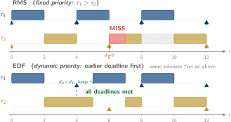

# Real-Time Operating Systems

## Week 4 — Earliest Deadline First &amp; RMS vs. EDF

Dynamic priority · $U \le 1$ theorem · engineering trade-offs · constrained deadlines

<div class="pt-10 opacity-70 text-sm">
  KMUTNB · Faculty of Engineering · M.Eng. in Electrical & Computer Engineering
</div>

<div class="abs-br m-6 text-xs opacity-50">
  Reading: Laplante Ch. 6 · Barry Ch. 3 · Liu &amp; Layland (1973)
</div>

<!--
RMS is optimal among fixed-priority algorithms, but fixed priority isn't the
only option. EDF changes the priority dynamically — every release, the job
closest to its deadline runs. The payoff: you can use 100 % of the CPU and
still guarantee every deadline.  This week we prove why, then compare the
two algorithms across every engineering dimension that matters in practice.
-->

---
layout: two-cols
layoutClass: gap-8
---

# From Week 3 to Week 4

Last week we closed the loop on RMS:

- **Rate Monotonic** is the optimal fixed-priority assignment
- **RTA** resolves inconclusive results exactly
- **Set B** failed: $R_3 = 10 > D_3 = 9$

One remedy for Set B: $U = 0.908 \le 1$ — the CPU is not overloaded.
So *some* algorithm can schedule it.

::right::

<div class="mt-10 px-5 py-4 rounded-lg bg-blue-50 dark:bg-blue-900/30 text-sm leading-relaxed">

**This week — the algorithm that can.**

- **EDF** — what it does and why it works
- The **$U \le 1$ theorem** — necessary and sufficient
- **RMS vs. EDF** — full engineering comparison
- **Constrained deadlines** — extending the analysis
- **Paper discussion** — read Liu &amp; Layland directly

<div class="mt-3 opacity-80">
By the end you understand when EDF beats RMS, and when it doesn't.
</div>

</div>

---

# Week 4 — Learning Objectives

By the end of this lecture you will be able to:

<v-clicks>

- **Define** Earliest Deadline First scheduling and describe how priority is assigned at runtime.
- **State and prove** the EDF schedulability theorem: $U \le 1$ is necessary and sufficient for implicit deadlines.
- **Compare** RMS and EDF on schedulability, overhead, overload behaviour, and implementation complexity.
- **Identify** task sets that RMS cannot schedule but EDF can, and vice versa.
- **Apply** the processor demand criterion (DBF) for EDF schedulability with constrained deadlines.
- **Discuss** why industry favours fixed-priority scheduling despite EDF's theoretical superiority.

</v-clicks>

<div v-click class="mt-6 px-4 py-2 border-l-4 border-amber-500 bg-amber-50 dark:bg-amber-900/20 text-sm">
Maps to <b>CLO 1</b> — <i>Explain the theoretical foundations of real-time scheduling and perform schedulability analysis.</i>
</div>

---
layout: section
---

# Part 1
## Earliest Deadline First — Dynamic Priority

---
layout: statement
---

# What EDF Does

At every scheduling point, run the job whose **absolute deadline is closest**.

<div class="mt-8 text-base opacity-80 max-w-2xl mx-auto">
Priority is not a property of the <b>task</b> — it is a property of the <b>job</b>,
recomputed at every release. The same task can be the highest-priority job
one moment and the lowest the next.
</div>

---
layout: two-cols
layoutClass: gap-6
---

# EDF Priority Rule

At any time $t$, among all ready jobs, schedule the one with the smallest **absolute deadline** $d_{i,j}$.

<div class="mt-4 text-sm">

| Algorithm | Priority key | When set |
|-----------|-------------|----------|
| RMS | $1/T_i$ (fixed) | task creation |
| EDF | $d_{i,j} = r_{i,j} + D_i$ | each job release |

</div>

<v-clicks>

<div class="mt-5 text-sm">

**Scheduling events that may trigger EDF re-evaluation:**
- A new job is released
- The running job completes
- (On preemptive EDF) any of the above

</div>

</v-clicks>

::right::

<div class="mt-10 px-5 py-4 rounded-lg bg-amber-50 dark:bg-amber-900/30 text-sm leading-relaxed">

### Example: two tasks at $t = 4$

Task τ₁ (period 4) releases job 2: deadline $d = 8$.

Task τ₂ (period 6) is running with deadline $d = 6$.

EDF compares: $d_{\tau_2} = 6 < d_{\tau_1} = 8$.

**τ₂ continues running** — not preempted, despite τ₁ arriving.

<div class="mt-3 opacity-80">
Under RMS τ₁ would preempt τ₂ here (shorter period = higher fixed priority),
causing τ₂ to miss its deadline at $t=6$.
</div>

</div>

---

# EDF vs. RMS — The Key Difference

<div class="my-3 flex justify-center">

</div>

<div class="grid grid-cols-2 gap-4 text-xs mt-1">

<div class="px-3 py-2 rounded bg-red-50 dark:bg-red-900/30">
<b>RMS:</b> τ₁ preempts τ₂ at t=4 (fixed priority). τ₂ job 1 misses deadline d=6. At U=1, RMS <b>fails</b>.
</div>

<div class="px-3 py-2 rounded bg-green-50 dark:bg-green-900/30">
<b>EDF:</b> at t=4, τ₂ keeps running (d₂=6 &lt; d₁=8). τ₂ meets d=6. All deadlines met at U=1.
</div>

</div>

---
layout: section
---

# Part 2
## EDF Schedulability — The Full CPU is Usable

---
layout: statement
---

# The EDF Theorem

For $n$ independent periodic tasks with **implicit deadlines** ($D_i = T_i$),<br/>
scheduled preemptively by EDF:

<div class="mt-8 text-xl">

$$U \le 1 \;\;\Longleftrightarrow\;\; \text{schedulable}$$

</div>

<div class="mt-6 text-sm opacity-80 max-w-2xl mx-auto">
Necessary <b>and</b> sufficient. Not just a gateway test — this is the <b>complete characterization</b>.
</div>

---
layout: two-cols
layoutClass: gap-6
---

# Proof — Necessity ($U \le 1$)

If $U > 1$, the total demand **exceeds** the available CPU time in any interval.

<div class="mt-4 text-sm">

Pick the hyperperiod $[0, H]$. The total work is:

$$ \sum_{i=1}^{n} \frac{H}{T_i} \cdot C_i = H \cdot U $$

If $U > 1$, this exceeds $H$ — there is strictly more work than time.

**No scheduler** can fit $H \cdot U > H$ units of work into $H$ units of time.

So $U > 1$ → infeasible for every algorithm.

</div>

::right::

<div class="mt-6">

### Proof — Sufficiency ($U \le 1$)

<div class="text-sm mt-2">

Suppose the EDF schedule has a **deadline miss** at time $t^*$. Then there is an interval $[t_0, t^*]$ where the CPU was busy the entire time, yet still ran out of time.

The total demand in $[t_0, t^*]$ must exceed $t^* - t_0$.

But each task can demand at most $\lfloor (t^* - t_0)/T_i \rfloor \cdot C_i \le U_i \cdot (t^* - t_0)$ in that window.

Summing: demand $\le U \cdot (t^* - t_0) \le t^* - t_0$ — **contradiction**.

So EDF has no deadline misses when $U \le 1$.

</div>

</div>

---

# EDF vs. RMS — Schedulability Gap

The gap between what EDF and RMS can schedule:

<div class="mt-5 flex justify-center">
<div class="text-sm max-w-2xl w-full">

| Utilization range | RMS verdict | EDF verdict |
|-------------------|-------------|-------------|
| $U \le U_{\text{lub}}(n)$ | Schedulable ✓ | Schedulable ✓ |
| $U_{\text{lub}}(n) < U \le 1$ | RTA needed (may fail) | **Always schedulable ✓** |
| $U > 1$ | Infeasible ✗ | Infeasible ✗ |

</div>
</div>

<div v-click class="mt-5 grid grid-cols-2 gap-4 text-sm">

<div class="px-4 py-3 rounded bg-amber-50 dark:bg-amber-900/30">
For large $n$, $U_{\text{lub}} \to \ln 2 \approx 0.693$.
<b>Up to 30.7 % of the CPU</b> is inaccessible to RMS but usable by EDF.
</div>

<div class="px-4 py-3 rounded bg-blue-50 dark:bg-blue-900/30">
Set B ($U = 0.908$) is easily scheduled by EDF — the utilization test passes immediately, no RTA needed.
</div>

</div>

---

# Set B Under EDF

Task set: τ₁(C=2,T=5), τ₂(C=2,T=7), τ₃(C=2,T=9) — $U = 0.908$

<div class="mt-4 grid grid-cols-2 gap-6 text-sm">

<div class="px-4 py-3 rounded-lg bg-red-50 dark:bg-red-900/20 border-2 border-red-400">
<div class="font-bold text-red-700 dark:text-red-300">RMS result (from Week 3)</div>
<div class="mt-2">τ₃ worst-case response time = 10 ms &gt; deadline 9 ms. <b>Infeasible.</b></div>
</div>

<div class="px-4 py-3 rounded-lg bg-green-50 dark:bg-green-900/20 border-2 border-green-400">
<div class="font-bold text-green-700 dark:text-green-300">EDF result</div>
<div class="mt-2">

$U = 0.908 \le 1$ → <b>Schedulable.</b> The utilization test is necessary and sufficient. Done.

</div>
</div>

</div>

<div v-click class="mt-5 text-sm px-4 py-2 border-l-4 border-blue-700 bg-blue-50 dark:bg-blue-900/20">
A set that demands an iterative RTA under RMS is settled in <b>one comparison</b> under EDF.
The price is paid elsewhere — runtime overhead and overload behaviour.
</div>

---
layout: section
---

# Part 3
## RMS vs. EDF — The Engineering Trade-off

---

# The Full Comparison

<div class="mt-3 text-sm">

| Dimension | RMS | EDF |
|-----------|-----|-----|
| **Priority type** | fixed (per task) | dynamic (per job) |
| **Schedulability test** | $U \le U_{\text{lub}}$ or RTA | $U \le 1$ |
| **CPU utilisation** | up to $\approx$69.3 % guaranteed | up to 100 % |
| **Runtime overhead** | O(1) dispatch | O(n) priority-queue update |
| **Implementation** | trivial (static priority table) | requires per-job deadline tracking |
| **Overload behaviour** | low-priority tasks miss; high-priority safe | any task can miss (unpredictable) |
| **Industry adoption** | dominant (AUTOSAR, FreeRTOS, VxWorks) | rare (research, some control) |
| **Tool support** | excellent (RTOS + analysis tools) | limited |
| **Transient overload** | graceful degradation | potential cascade failure |

</div>

---
layout: two-cols
layoutClass: gap-6
---

# Why RMS Still Wins in Practice

Despite EDF's theoretical superiority, **fixed-priority dominates** safety-critical engineering.

<v-clicks>

**Predictable degradation**

Under transient overload, low-priority tasks suffer but high-priority tasks keep meeting their deadlines. The system degrades in a known, designed order.

**Certification**

IEC 61508, ISO 26262, DO-178C analysis tools are mature for fixed-priority. EDF certification paths are much harder.

</v-clicks>

::right::

<div class="mt-10 px-5 py-4 rounded-lg bg-blue-50 dark:bg-blue-900/30 text-sm leading-relaxed">

**EDF under overload**

When $U > 1$ under EDF, **any task** may miss a deadline — the algorithm has no way to protect high-priority work.

<div class="mt-3">
The classic failure: a bursty interrupt load pushes $U$ above 1 for a brief window. Under EDF, every task in the system is at risk. Under RMS, only the lowest-priority ones are.
</div>

<div class="mt-3 opacity-80 text-xs">
This is called the <b>domino effect</b> — one overloaded task cascades into missed deadlines everywhere.
</div>

</div>

---

# When EDF Is the Right Choice

EDF is preferred when:

<v-clicks>

<div class="mt-4 grid grid-cols-2 gap-4 text-sm">

<div class="px-4 py-3 rounded-lg bg-green-50 dark:bg-green-900/20">
<div class="font-bold text-green-700 dark:text-green-300">High utilization is unavoidable</div>
<div class="mt-2">The task set demands U &gt; 0.69 and redesign is not possible. EDF schedules it; RMS cannot.</div>
</div>

<div class="px-4 py-3 rounded-lg bg-green-50 dark:bg-green-900/20">
<div class="font-bold text-green-700 dark:text-green-300">All tasks have equal criticality</div>
<div class="mt-2">No "must protect this task above all others" requirement. EDF's uniform treatment is fair and optimal.</div>
</div>

<div class="px-4 py-3 rounded-lg bg-green-50 dark:bg-green-900/20">
<div class="font-bold text-green-700 dark:text-green-300">Soft-real-time context</div>
<div class="mt-2">Multimedia, networking — occasional misses are tolerable; maximizing throughput matters more.</div>
</div>

<div class="px-4 py-3 rounded-lg bg-green-50 dark:bg-green-900/20">
<div class="font-bold text-green-700 dark:text-green-300">Research and academia</div>
<div class="mt-2">EDF is theoretically elegant and the baseline for most advanced scheduling research (EDF+, mixed-criticality, reservation-based).</div>
</div>

</div>

</v-clicks>

---
layout: section
---

# Part 4
## Beyond Implicit Deadlines

---
layout: two-cols
layoutClass: gap-6
---

# Constrained Deadlines and EDF

When $D_i < T_i$, the $U \le 1$ test is no longer sufficient.

**Intuition:** even if the CPU is not overloaded overall, a tight deadline window can create local demand that exceeds supply.

<div class="mt-4 text-sm">

Need the **Processor Demand Criterion** (Baruah et al., 1990):

For every interval length $L > 0$:

$$ \text{dbf}(0, L) \;=\; \sum_{i=1}^{n} \max\!\left(0,\; \left\lfloor \frac{L - D_i}{T_i} \right\rfloor + 1\right) C_i \;\le\; L $$

</div>

::right::

<div class="mt-6 px-5 py-4 rounded-lg bg-blue-50 dark:bg-blue-900/30 text-sm leading-relaxed">

### Demand Bound Function (DBF)

$\text{dbf}(0, L)$ counts only jobs whose **both** release time and deadline fall within $[0, L]$ — the "firmly bounded" demand.

<div class="mt-3">
In practice you only need to check $L$ at <b>scheduling points</b> — absolute deadlines. The check is finite over one hyperperiod.
</div>

<div class="mt-3 opacity-80">
For implicit deadlines ($D_i = T_i$) the DBF simplifies back to $U \le 1$ — consistent with the earlier theorem.
</div>

</div>

---

# Arbitrary Deadlines

When $D_i > T_i$ (jobs of the same task can overlap), analysis becomes significantly harder:

<v-clicks>

<div class="mt-5 grid grid-cols-3 gap-4 text-sm">

<div class="px-4 py-3 rounded-lg bg-gray-100 dark:bg-gray-800">
<div class="font-bold">Implicit ($D_i = T_i$)</div>
<div class="mt-2">EDF: $U \le 1$<br/>RMS: $U \le U_{\text{lub}}$ or RTA.<br/>Analysis tractable.</div>
</div>

<div class="px-4 py-3 rounded-lg bg-amber-50 dark:bg-amber-900/30">
<div class="font-bold">Constrained ($D_i \le T_i$)</div>
<div class="mt-2">EDF: DBF test.<br/>RMS: DMS + extended RTA.<br/>Still polynomial.</div>
</div>

<div class="px-4 py-3 rounded-lg bg-rose-50 dark:bg-rose-900/30">
<div class="font-bold">Arbitrary ($D_i$ unconstrained)</div>
<div class="mt-2">Feasibility testing is <b>coNP-hard</b>. Simulation or bounding approaches needed.</div>
</div>

</div>

</v-clicks>

<div v-click class="mt-5 text-sm px-4 py-2 border-l-4 border-blue-700 bg-blue-50 dark:bg-blue-900/20">
The RTOS practitioner's rule: design your task set with <b>implicit or constrained</b> deadlines.
Arbitrary deadlines signal a design smell — something that probably should be two separate tasks.
</div>

---
layout: section
---

# Part 5
## Scheduling in Practice

---

# What RTOSes Actually Implement

Most commercial and open-source RTOSes are **fixed-priority preemptive**:

<div class="mt-4 text-sm">

| RTOS | Scheduling | Notes |
|------|-----------|-------|
| **FreeRTOS** | Fixed-priority, FIFO within priority | Up to 32 priority levels (configurable) |
| **Zephyr** | Fixed-priority, FIFO within priority | Cooperative or preemptive mode |
| **VxWorks** | Fixed-priority | 256 levels; used in aerospace |
| **RTEMS** | Fixed-priority | DO-178 certified versions |
| **OSEK/AUTOSAR OS** | Fixed-priority | BCC1/2, ECC1/2 conformance classes |
| **Linux SCHED_DEADLINE** | EDF (global) | For soft-RT workloads |
| **LITMUS^RT** (research) | EDF/Pfair | Multi-core research platform |

</div>

<div v-click class="mt-4 text-sm px-4 py-2 border-l-4 border-blue-700 bg-blue-50 dark:bg-blue-900/20">
Note: FreeRTOS and Zephyr — our targets this semester — are both fixed-priority. You will implement RMS priority assignment, not EDF.
</div>

---

# FreeRTOS Priorities — Practical Rules

FreeRTOS: **larger number = higher priority**. `configMAX_PRIORITIES` sets the count (default 5–7).

<div class="mt-4 text-sm">

```c {all|1-5|7-12|14-17}{maxHeight:'260px'}
/* FreeRTOSConfig.h — project-wide */
#define configMAX_PRIORITIES  8   /* priorities 0..7 */
#define configUSE_PREEMPTION  1   /* preemptive, as required by RMS */
#define configUSE_TIME_SLICING 0  /* no round-robin within a priority level */

/* Task creation — map RMS order explicitly */
/* Task with shortest period → highest priority number */
xTaskCreate(vFastTask,   "fast",  256, NULL, 7 /* highest */, NULL);
xTaskCreate(vMediumTask, "med",   256, NULL, 5,               NULL);
xTaskCreate(vSlowTask,   "slow",  256, NULL, 3 /* lowest  */, NULL);

/* Idle task runs at priority 0 — always below application tasks */

/* One tick = 1 ms by default (configTICK_RATE_HZ = 1000) */
/* Smallest observable period: 1 ms.                        */
/* vTaskDelayUntil gives exact period — use it, not vTaskDelay. */
```

</div>

<div v-click class="mt-3 text-sm px-4 py-2 border-l-4 border-amber-500 bg-amber-50 dark:bg-amber-900/20">
Leave gaps between priority numbers (e.g. 3, 5, 7) so you can insert new tasks later without renumbering everything.
</div>

---

# A Taste of Mixed Criticality

Modern embedded systems often mix **different criticality levels** on one platform:

<div class="mt-5 grid grid-cols-2 gap-6 text-sm">

<div class="px-4 py-3 rounded-lg bg-blue-50 dark:bg-blue-900/30">
<div class="font-bold text-blue-700 dark:text-blue-300">Safety-critical tasks</div>
<div class="mt-2">Formal WCET, certified. Must never miss — high priority, high confidence in Cᵢ bound.</div>
</div>

<div class="px-4 py-3 rounded-lg bg-gray-100 dark:bg-gray-800">
<div class="font-bold">Best-effort tasks</div>
<div class="mt-2">Soft deadlines, approximate WCET. Can miss under overload — low priority, pessimistic Cᵢ acceptable.</div>
</div>

</div>

<div v-click class="mt-5 text-sm px-4 py-2 border-l-4 border-amber-500 bg-amber-50 dark:bg-amber-900/20">
This is the <b>mixed-criticality scheduling</b> problem (Vestal 2007). On the ARM Cortex-M33 with TrustZone-M (our hardware), the Secure/Non-Secure partition maps naturally onto a two-criticality split — we revisit this in <b>Week 11</b>.
</div>

---
layout: section
---

# Part 6
## Paper Discussion — Liu &amp; Layland (1973)

---

# Liu &amp; Layland (1973) — The Paper

**"Scheduling algorithms for multiprogramming in a hard-real-time environment"**
C.L. Liu and J.W. Layland · *Journal of the ACM, 20(1)*, 1973.

<div class="mt-5 grid grid-cols-2 gap-6 text-sm">

<div class="px-4 py-3 rounded-lg bg-blue-50 dark:bg-blue-900/30">
<div class="font-bold text-blue-700 dark:text-blue-300">Why this paper matters</div>
<div class="mt-2">It defined the task model that the entire field still uses. It proved RMS optimality and the utilization bound in the same paper — a 50-year foundation.</div>
</div>

<div class="px-4 py-3 rounded-lg bg-amber-50 dark:bg-amber-900/30">
<div class="font-bold text-amber-700 dark:text-amber-300">Historical context</div>
<div class="mt-2">Published when real-time computing meant military radar and avionics. The model was abstract; the impact was enormous. Still cited 2000+ times per year.</div>
</div>

</div>

<div v-click class="mt-5 text-sm px-4 py-2 border-l-4 border-blue-700 bg-blue-50 dark:bg-blue-900/20">
This week you read §1–5 in full. The discussion will cover the assumptions, the proofs, and what the paper got wrong (or left open) for later researchers to fix.
</div>

---

# Reading Guide — What to Find

<div class="mt-4 text-sm">

<v-clicks>

**§1 Introduction** — What problem does the paper set up? What are the three assumptions that simplify the analysis?

**§2 The task model** — How does Liu &amp; Layland define a task? What is the key simplification versus our "full" tuple from Week 2?

**§3 Rate monotonic algorithm** — Find Theorem 1 (RMS optimality). Understand the exchange argument. Can you explain it to someone else without the paper?

**§4 The bound** — Find the utilization bound derivation. The proof constructs a worst-case two-task set — can you trace through it?

**§5 Earliest deadline algorithm** — Note that this section is much shorter. Why? What do the authors say about EDF vs. RMS?

</v-clicks>

</div>

---

# Discussion Questions

Bring answers to these for the in-class discussion:

<div class="mt-4 text-sm">

<v-clicks>

1. Liu &amp; Layland assume tasks are **independent** (no shared resources, no synchronization). What real-world phenomenon does this exclude? What happens to RMS optimality when tasks share a resource?

2. The paper proves the utilization bound for **implicit deadlines** ($D_i = T_i$). Is the bound tighter or looser for constrained deadlines ($D_i < T_i$)? Why?

3. The paper shows EDF achieves $U \le 1$. The authors note RMS is "simpler to implement". In 1973, was that the decisive factor? Is it still in 2025?

4. The paper analyses a **single processor**. Which of its results carry over to multi-core, and which do not?

5. Set B (τ₁,τ₂,τ₃ with $U=0.908$) is infeasible under RMS but feasible under EDF. Write a brief argument for why you would or would not use EDF for Set B in a safety-critical automotive application.

</v-clicks>

</div>

---
layout: default
---

# Key Takeaways

<v-clicks>

- **EDF** assigns priority dynamically — always run the job with the **earliest absolute deadline**.
- The **EDF theorem** (implicit deadlines): $U \le 1$ is **necessary and sufficient**. The full CPU is usable.
- **RMS vs. EDF**: EDF offers up to 30.7 % more usable capacity, but fixed-priority (RMS) dominates safety-critical engineering due to predictable overload behaviour and toolchain maturity.
- For **constrained deadlines** ($D_i < T_i$), the DBF test replaces $U \le 1$ for EDF; DMS replaces RMS.
- **Set B** ($U=0.908$), which RMS cannot schedule, is trivially schedulable under EDF.
- The **Liu &amp; Layland (1973)** paper introduced the task model, RMS optimality, and the utilization bound — all in one paper. Understanding it deeply is foundational.

</v-clicks>

<div v-click class="mt-5 text-center text-base px-4 py-2 rounded bg-blue-100 dark:bg-blue-900/40">
Next week — <b>Aperiodic &amp; Sporadic Servers</b>: how to handle irregular workloads inside a provably schedulable fixed-priority framework.
</div>

---

# Before Next Week

<div class="grid grid-cols-2 gap-8 mt-6">

<div>

### Reading
- **Laplante**, Ch. 6 — EDF and dynamic priority scheduling
- **Barry**, Ch. 3 — practical scheduling in embedded systems
- **Liu &amp; Layland (1973)** — §1–5 in full (preparation for discussion)

### Lab
- No new hardware lab this week
- Complete the **paper discussion prep** (answers to the five questions)
- Experiment: implement EDF-like behaviour with FreeRTOS by updating task priority on each release — does $U=0.908$ now work?

</div>

<div>

### Check yourself
<div class="text-sm">

1. Task set: τ₁(C=1,T=3), τ₂(C=2,T=5), τ₃(C=2,T=6). Compute U. Apply the EDF theorem. Can RMS schedule this set?
2. Under EDF, at time $t=6$ you have two ready jobs: τ₁ with $d=8$ and τ₂ with $d=7$. Which runs? What changes at $t=6.5$ if τ₃ arrives with $d=6.5$?
3. Explain in one sentence why EDF cannot provide "guaranteed protection" for the highest-priority task under overload.
4. A task set has $n=10$ tasks and $U=0.75$. Is it schedulable under (a) RMS, (b) EDF? Justify.

</div>

</div>

</div>

---
layout: end
class: text-center
---

# Week 4 Complete

Earliest Deadline First &amp; RMS vs. EDF

<div class="mt-4 text-sm opacity-70">
Real-Time Operating Systems · KMUTNB · M.Eng. ECE<br/>
Next — Week 5 · Aperiodic &amp; Sporadic Servers
</div>

<style>
:root {
  --slidev-theme-primary: #003874;
}
.slidev-layout h1 {
  color: #003874;
}
.dark .slidev-layout h1 {
  color: #7ba7d9;
}
table {
  font-size: 0.92em;
}
</style>
