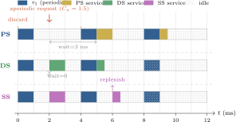

# Real-Time Operating Systems

## Week 5 — Aperiodic &amp; Sporadic Servers

Polling · deferrable · sporadic servers · bandwidth preservation

<div class="pt-10 opacity-70 text-sm">
  KMUTNB · Faculty of Engineering · M.Eng. in Electrical & Computer Engineering
</div>

<div class="abs-br m-6 text-xs opacity-50">
  Reading: Laplante Ch. 6 · Barry Ch. 7
</div>

<!--
For four weeks every task has been periodic — a clean, repeating release pattern
that RMS and EDF analysis depends on. Real systems are not so tidy: buttons get
pressed, packets arrive, faults fire. This week is about servicing that irregular
work *without* destroying the schedulability guarantees we worked so hard to
build. The answer is the aperiodic server — a periodic "container" that lends a
bounded slice of CPU bandwidth to irregular requests.
-->

---
layout: two-cols
layoutClass: gap-8
---

# From Week 4 to Week 5

Module 2 so far assumed one thing about every task:

- **Periodic releases** — a job every $T_i$, forever
- RMS, RTA, EDF, the utilization bound — **all** rest on that assumption
- The whole analysis is a function of $(C_i, T_i, D_i)$

But real workloads are not all periodic:

- A user presses a button — **when?**
- A network packet arrives — **how often?**
- A fault alarm fires — **rarely, but urgently**

::right::

<div class="mt-10 px-5 py-4 rounded-lg bg-blue-50 dark:bg-blue-900/30 text-sm leading-relaxed">

**This week — irregular work, kept under control.**

- **Task types** — periodic vs. aperiodic vs. sporadic
- **Naive handling** — and why it fails
- **Polling server** — the simplest fix
- **Deferrable &amp; sporadic servers** — bandwidth-preserving
- **Sporadic tasks** — folding them into RMS
- **FreeRTOS** — the deferred-interrupt pattern (Lab 3)

<div class="mt-3 opacity-80">
By the end you can service an aperiodic event quickly <i>and</i> still prove the periodic deadlines hold.
</div>

</div>

---

# Week 5 — Learning Objectives

By the end of this lecture you will be able to:

<v-clicks>

- **Distinguish** periodic, aperiodic, and sporadic tasks by arrival pattern, inter-arrival bound, and deadline class.
- **Explain** why the two naive strategies — background and immediate — trade responsiveness against guarantees.
- **Describe** the polling server and analyse it as an ordinary periodic task within RMS.
- **Contrast** the deferrable and sporadic servers as bandwidth-preserving mechanisms.
- **Justify** why the deferrable server lowers the RMS utilization bound while the sporadic server does not.
- **Convert** a sporadic task into an equivalent periodic task using its minimum inter-arrival time.
- **Map** these concepts onto the FreeRTOS deferred-interrupt pattern used in Lab 3.

</v-clicks>

<div v-click class="mt-6 px-4 py-2 border-l-4 border-amber-500 bg-amber-50 dark:bg-amber-900/20 text-sm">
Maps to <b>CLO 1</b> — <i>Explain the theoretical foundations of real-time scheduling and perform schedulability analysis.</i>
</div>

---
layout: section
---

# Part 1
## The Aperiodic Problem

---
layout: statement
---

# Not Everything Is Periodic

A periodic task announces itself: a job every $T_i$, predictable forever.

<div class="mt-8 text-base opacity-80 max-w-2xl mx-auto">
An <b>aperiodic</b> event arrives when the physical world decides — a keypress,
a packet, an alarm. The scheduler cannot plan for what it cannot predict.
The job of this week is to make the unpredictable <b>analysable</b> again.
</div>

---

# Three Kinds of Task

Every recurring activity in a real-time system falls into one of three classes:

<div class="mt-4 text-sm">

| Class | Arrival pattern | Inter-arrival time | Typical deadline | Example |
|-------|-----------------|--------------------|--------------------|---------|
| **Periodic** | fixed, repeating | exactly $T_i$ | hard | control loop, sensor sampling |
| **Sporadic** | irregular | $\ge$ a known **minimum** $a_i$ | hard | fault alarm, emergency stop |
| **Aperiodic** | irregular | **no** lower bound | soft | UI event, logging, diagnostics |

</div>

<div v-click class="mt-5 grid grid-cols-2 gap-4 text-sm">

<div class="px-4 py-3 rounded-lg bg-green-50 dark:bg-green-900/30">

<b>Sporadic = analysable.</b> A guaranteed minimum gap $a_i$ caps how much CPU it can ever demand — so it can be folded into RMS (Part 5).

</div>

<div class="px-4 py-3 rounded-lg bg-amber-50 dark:bg-amber-900/30">
<b>Aperiodic = dangerous.</b> With no minimum gap, a burst of arrivals can demand unbounded CPU. This is the case that needs a <b>server</b>.
</div>

</div>

---
layout: two-cols
layoutClass: gap-6
---

# The Aperiodic Dilemma

We must service aperiodic work — but the periodic tasks already have proven deadlines. Two obvious strategies, both flawed:

<div class="mt-4 text-sm">

**① Background processing**

Run aperiodic work at a priority **below every periodic task**.

- ✓ Periodic guarantees untouched — it only uses slack
- ✗ Response time is terrible and unbounded — a busy periodic set can starve it indefinitely

</div>

::right::

<div class="mt-14 text-sm">

**② Immediate / interrupt-driven**

Run aperiodic work at a priority **above the periodic tasks** (e.g. straight in the ISR).

- ✓ Excellent, near-instant response
- ✗ An aperiodic burst preempts everything — periodic deadlines **break**. Schedulability is lost.

</div>

<div v-click class="mt-6 px-4 py-3 rounded-lg bg-blue-50 dark:bg-blue-900/30 text-sm">
We want <b>fast response</b> <i>and</i> <b>protected periodic deadlines</b>. Neither extreme delivers both.
</div>

---

# The Idea of a Server

A **server** is a periodic task whose job is to *carry* aperiodic work.

<div class="mt-5 grid grid-cols-3 gap-4 text-sm">

<div v-click class="px-4 py-3 rounded-lg bg-gray-100 dark:bg-gray-800">

**Budget — capacity $C_s$**

The maximum CPU time the server may spend on aperiodic requests within one period.

</div>

<div v-click class="px-4 py-3 rounded-lg bg-gray-100 dark:bg-gray-800">

**Period — $T_s$**

How often the budget is **replenished**. Sets the server's priority under RMS.

</div>

<div v-click class="px-4 py-3 rounded-lg bg-gray-100 dark:bg-gray-800">

**Replenishment rule**

Exactly **when** spent budget comes back. This single rule is what separates the three server types.

</div>

</div>

<div v-click class="mt-6 text-sm px-4 py-2 border-l-4 border-blue-700 bg-blue-50 dark:bg-blue-900/20">

The server has a **bounded** utilization $U_s = C_s / T_s$. To the periodic tasks it simply looks like one more task — so the schedulability analysis from Weeks 3–4 still applies. The aperiodic chaos is now contained inside a known box.

</div>

---

# Aperiodic Server Comparison

<div class="my-3 flex justify-center">

</div>

<div class="grid grid-cols-3 gap-3 text-xs mt-1">
<div class="px-3 py-2 rounded bg-amber-50 dark:bg-amber-900/30">
<b>PS:</b> budget discarded if no request at poll point — aperiodic waits until next period boundary (worst-case wait ≈ Tₛ).
</div>
<div class="px-3 py-2 rounded bg-green-50 dark:bg-green-900/30">
<b>DS:</b> budget held until used — aperiodic served immediately when budget available. Best response, but RMS analysis is harder.
</div>
<div class="px-3 py-2 rounded bg-blue-50 dark:bg-blue-900/30">
<b>SS:</b> replenishes Tₛ after consumption — immediate service like DS, with RMS-compatible schedulability analysis.
</div>
</div>

---
layout: section
---

# Part 2
## The Polling Server

---
layout: two-cols
layoutClass: gap-6
---

# Polling Server — Mechanics

The simplest server. It behaves **exactly** like a periodic task.

<div class="mt-3 text-sm">

At every period $T_s$ the polling server wakes and:

1. **Requests pending?** Service them, consuming up to $C_s$ of budget.
2. **Queue empty?** Suspend **immediately** — any unused budget is **discarded** until the next period.

</div>

<v-click>

<div class="mt-4 text-sm px-3 py-2 rounded bg-green-50 dark:bg-green-900/30">

Because it polls on a fixed period and never defers capacity, it **is** a periodic task: $\tau_s = (C_s, T_s)$.

</div>

</v-click>

::right::

<div class="mt-6 px-5 py-4 rounded-lg bg-blue-50 dark:bg-blue-900/30 text-sm leading-relaxed">

### Schedulability

Add the server as one more periodic task and apply the **Week 3** test:

$$ U = \sum_{i=1}^{n}\frac{C_i}{T_i} \;+\; \frac{C_s}{T_s} \;\le\; U_{\text{lub}}(n{+}1) $$

<div class="mt-3">
If the test fails, use RTA — the server is treated identically to any periodic task.
</div>

<div class="mt-3 opacity-80">
No new theory required. That is the polling server's great virtue.
</div>

</div>

---

# Polling Server — The Lost-Capacity Flaw

If a request arrives **just after** a poll, it waits almost a full period $T_s$:

```text
  Polling server:  Cs = 2,  Ts = 8

  t:   0         8                  16
       |poll|    |poll|             |poll|
       ▼━━━━▼    ▼━━━━▼             ▼━━━━━ ...
       queue     serve the          ...
       empty →   request (2 units)
       budget
       DISCARDED
                 ▲
            request arrives at t = 1
            — missed the t=0 poll, waits until t=8
            aperiodic response latency ≈ 7
```

<div class="mt-3 grid grid-cols-2 gap-4 text-sm">

<div v-click class="px-4 py-3 rounded-lg bg-red-50 dark:bg-red-900/30">

<b>Worst case:</b> a request that just misses a poll waits up to $T_s$ before service even <i>begins</i>. Budget sitting idle is thrown away.

</div>

<div v-click class="px-4 py-3 rounded-lg bg-amber-50 dark:bg-amber-900/30">

<b>Fix the symptom?</b> Shrinking $T_s$ improves latency but raises overhead and the server's priority — squeezing the periodic tasks.

</div>

</div>

<div v-click class="mt-4 text-sm px-4 py-2 border-l-4 border-blue-700 bg-blue-50 dark:bg-blue-900/20">
The real fix: <b>preserve</b> the budget instead of discarding it — a <i>bandwidth-preserving</i> server.
</div>

---
layout: section
---

# Part 3
## The Deferrable Server

---
layout: two-cols
layoutClass: gap-6
---

# Deferrable Server — Keep the Budget

The deferrable server (DS) fixes the polling server's waste with one change:

<div class="mt-3 text-sm">

**Capacity is preserved, not discarded.**

- The full budget $C_s$ is **replenished at every period boundary** $kT_s$.
- If no request is pending, the server **keeps** its capacity — ready to spend the instant a request arrives.
- A request can be served *immediately*, at the server's (high) priority, with **zero polling delay**.

</div>

<v-click>

<div class="mt-4 text-sm px-3 py-2 rounded bg-green-50 dark:bg-green-900/30">

Response time collapses from "up to $T_s$" to "as soon as budget is available" — usually at once.

</div>

</v-click>

::right::

<div class="mt-6 px-5 py-4 rounded-lg bg-amber-50 dark:bg-amber-900/30 text-sm leading-relaxed">

### The catch

By holding its budget, the DS no longer behaves like a periodic task.

<div class="mt-3">

It can spend $C_s$ **late** in period $k$ and another full $C_s$ **early** in period $k{+}1$ — releasing up to $2C_s$ of work in a window much shorter than $T_s$.

</div>

<div class="mt-3 opacity-80">
That burst is something a true periodic task can never produce. The standard Liu &amp; Layland bound no longer holds.
</div>

</div>

---

# Deferrable Server — The Back-to-Back Hit

```text
  Deferrable server:  Cs = 3,  Ts = 10

  period k                        period k+1
  +-------------------------------+-------------------------------+
  0          budget idle ...     7|10                            20
                                 [###|###]
                                  Cs   Cs
                          spends Cs at   spends fresh Cs at
                          t = 7..10      t = 10..13
                                 <--- 2*Cs in 6 time units --->
```

<div class="mt-3 grid grid-cols-2 gap-4 text-sm">

<div class="px-4 py-3 rounded-lg bg-red-50 dark:bg-red-900/30">

<b>Double hit:</b> a lower-priority periodic task can be preempted for $2C_s$ in quick succession — interference a periodic task of utilization $U_s$ would never cause.

</div>

<div class="px-4 py-3 rounded-lg bg-blue-50 dark:bg-blue-900/30">
<b>Consequence:</b> the DS must be analysed with a <b>reduced</b> utilization bound — schedulability is paid for with capacity.
</div>

</div>

<div v-click class="mt-3 text-xs px-4 py-2 rounded bg-gray-100 dark:bg-gray-800">

For reference — Lehoczky, Sha &amp; Strosnider (1987) give the bound for $n$ periodic tasks plus one DS of utilization $U_s$:
$\;U_{\text{lub}} = U_s + n\left[\left(\dfrac{U_s + 2}{2U_s + 1}\right)^{1/n} - 1\right]$ — strictly below $\ln 2$ as $U_s$ grows.

</div>

---
layout: section
---

# Part 4
## The Sporadic Server

---
layout: two-cols
layoutClass: gap-6
---

# Sporadic Server — Smarter Replenishment

The sporadic server (SS) keeps the deferrable server's fast response **and** restores clean RMS analysis. The trick is *when* budget returns.

<div class="mt-3 text-sm">

**Deferrable server:** replenish to full $C_s$ at every fixed boundary $kT_s$.

**Sporadic server:** replenishment is **tied to consumption** —

- When the server **starts** consuming budget at time $t$, schedule that amount to return at $t + T_s$.
- Spent budget always comes back *exactly one period after it was used* — never sooner.

</div>

::right::

<div class="mt-6 px-5 py-4 rounded-lg bg-green-50 dark:bg-green-900/30 text-sm leading-relaxed">

### Why it works

The consumption-plus-$T_s$ rule guarantees the server can **never** demand more than $C_s$ within *any* window of length $T_s$.

<div class="mt-3">

That is precisely the property of a periodic — or sporadic — task. So the SS can be modelled as an ordinary periodic task $\tau_s = (C_s, T_s)$.

</div>

<div class="mt-3 font-semibold">
No back-to-back burst. No bound penalty.
</div>

</div>

---

# Sporadic Server — Best of Both Worlds

Sprunt, Sha &amp; Lehoczky (1989) proved the key result:

<div class="mt-3 px-5 py-3 rounded-lg bg-blue-50 dark:bg-blue-900/30 text-center text-base">
A sporadic server may be treated as a <b>standard periodic task</b> for schedulability analysis.
</div>

<div class="mt-5 text-sm">

| Property | Polling | Deferrable | Sporadic |
|----------|---------|------------|----------|
| Aperiodic response time | poor (up to $T_s$) | excellent | excellent |
| Preserves unused budget | ✗ | ✓ | ✓ |
| Behaves like a periodic task | ✓ | ✗ | ✓ |
| Uses full Liu &amp; Layland bound | ✓ | ✗ (reduced) | ✓ |
| Implementation complexity | low | low | **higher** |

</div>

<div v-click class="mt-4 text-sm px-4 py-2 border-l-4 border-amber-500 bg-amber-50 dark:bg-amber-900/20">
The price of the sporadic server is <b>bookkeeping</b>: every chunk of consumed budget needs its own replenishment time and amount. The kernel tracks a small set of pending replenishment events instead of a single periodic reset.
</div>

---
layout: section
---

# Part 5
## Sporadic Tasks &amp; Choosing a Server

---
layout: two-cols
layoutClass: gap-6
---

# Sporadic Tasks → Periodic

A **sporadic task** has no period — but it does have a guaranteed **minimum inter-arrival time** $a_i$.

<div class="mt-4 text-sm">

The worst case for the CPU is when it arrives **as often as it possibly can** — once every $a_i$.

<div class="mt-3 px-3 py-2 rounded bg-green-50 dark:bg-green-900/30">

So analyse it as a periodic task with

$$ T_i = a_i, \qquad D_i \text{ and } C_i \text{ unchanged} $$

and apply RMS / RTA **directly**.

</div>

</div>

<div class="mt-3 text-sm opacity-80">

If the set is schedulable at $T_i = a_i$, it is schedulable for <i>any</i> slower arrival pattern — fewer jobs only ever helps.

</div>

::right::

<div class="mt-6 px-5 py-4 rounded-lg bg-blue-50 dark:bg-blue-900/30 text-sm leading-relaxed">

### Worked example

A fault-alarm task: $C = 2$ ms, minimum inter-arrival $a = 20$ ms, deadline $D = 15$ ms.

<div class="mt-2">

Model it as periodic: $T = 20$ ms, $D = 15$ ms (a **constrained** deadline).

</div>

<div class="mt-2">
Now run deadline-monotonic priority assignment + RTA, exactly as in Week 3.
</div>

<div class="mt-3 opacity-80">
This is why sporadic tasks need <b>no server</b> — the minimum gap already bounds their demand. Servers exist for the <i>aperiodic</i> case, which has no such gap.
</div>

</div>

---

# Choosing the Right Mechanism

<div class="mt-3 text-sm">

| Situation | Use | Why |
|-----------|-----|-----|
| Sporadic task, hard deadline, known $a_i$ | **Treat as periodic** ($T = a_i$) | Demand is already bounded — no server needed |
| Aperiodic, soft deadline, response time irrelevant | **Background** | Costs nothing; uses slack only |
| Aperiodic, soft deadline, simple system | **Polling server** | Trivial to build and analyse |
| Aperiodic, needs fast response, simple analysis essential | **Sporadic server** | Fast *and* analysed as periodic |
| Aperiodic, fast response, capacity to spare | **Deferrable server** | Simpler than SS if the reduced bound still passes |

</div>

<div v-click class="mt-5 grid grid-cols-2 gap-4 text-sm">

<div class="px-4 py-3 rounded-lg bg-blue-50 dark:bg-blue-900/30">

<b>Tuning a server:</b> larger $C_s$ → better aperiodic responsiveness, but more interference on periodic tasks. It is a direct bandwidth trade.

</div>

<div class="px-4 py-3 rounded-lg bg-amber-50 dark:bg-amber-900/30">

<b>Picking $T_s$:</b> a shorter period raises the server's RMS priority and lowers latency — but pay attention to overhead and to the other periods.

</div>

</div>

---
layout: section
---

# Part 6
## In Practice — FreeRTOS &amp; Deferred Interrupts

---

# FreeRTOS Has No Built-in Servers

FreeRTOS is **fixed-priority preemptive** — it ships *no* polling, deferrable, or sporadic server. You build the behaviour from primitives:

<div class="mt-4 grid grid-cols-2 gap-6 text-sm">

<div class="px-4 py-3 rounded-lg bg-blue-50 dark:bg-blue-900/30">
<div class="font-bold text-blue-700 dark:text-blue-300">Deferred interrupt processing</div>
<div class="mt-2">The <b>core pattern</b>. A short ISR captures the event and signals a handler task that does the real work — a "top half / bottom half" split.</div>
</div>

<div class="px-4 py-3 rounded-lg bg-gray-100 dark:bg-gray-800">
<div class="font-bold">Software timers</div>
<div class="mt-2">A periodic timer callback that polls a request queue <b>is</b> a polling server. The timer service (daemon) task carries the budget.</div>
</div>

</div>

<div v-click class="mt-5 text-sm px-4 py-2 border-l-4 border-amber-500 bg-amber-50 dark:bg-amber-900/20">
The handler task's <b>priority</b> is the server's priority, and how you pace it (notification, queue, timer) sets the replenishment behaviour. You are hand-building a server — and you must analyse it as one.
</div>

---

# Why Defer? Keep the ISR Short

An interrupt handler runs **above all tasks** — every cycle spent there is interference no scheduler can preempt.

<div class="mt-4 grid grid-cols-2 gap-6 text-sm">

<div class="px-4 py-3 rounded-lg bg-red-50 dark:bg-red-900/30">
<div class="font-bold text-red-700 dark:text-red-300">Work done <i>in</i> the ISR</div>
<div class="mt-2">Adds directly to <b>interrupt latency</b> for every other task. Long ISRs = unbounded blocking = broken analysis.</div>
</div>

<div class="px-4 py-3 rounded-lg bg-green-50 dark:bg-green-900/30">
<div class="font-bold text-green-700 dark:text-green-300">Work <i>deferred</i> to a task</div>
<div class="mt-2">Runs at a normal priority the scheduler can manage — it appears in the task model and the RMS analysis.</div>
</div>

</div>

<div v-click class="mt-5 text-sm px-4 py-2 border-l-4 border-blue-700 bg-blue-50 dark:bg-blue-900/20">
Rule of thumb: the ISR does the <b>minimum</b> — read the hardware, clear the flag, signal the task — and returns. Everything else is the handler task's job. (We quantify interrupt latency formally in <b>Week 9</b>.)
</div>

---

# The Deferred-Interrupt Pattern

```c {all|1-9|11-22|24-31}{maxHeight:'320px'}
/* Handler task — the "server". Its priority = the server priority. */
void vAperiodicHandlerTask(void *pv)
{
    for (;;) {
        /* Block with zero CPU cost until the ISR signals an event */
        ulTaskNotifyTake(pdTRUE, portMAX_DELAY);

        process_event();          /* the real, bounded aperiodic work */
    }
}

/* ISR — the "top half". As short as physically possible. */
void GPIO_IRQHandler(void)
{
    BaseType_t xHigherPriorityTaskWoken = pdFALSE;

    clear_interrupt_flag();       /* acknowledge the hardware  */

    /* Defer: unblock the handler task, do NOT process here */
    vTaskNotifyGiveFromISR(xHandlerTask, &xHigherPriorityTaskWoken);

    /* Switch to the handler immediately if it now out-prioritises us */
    portYIELD_FROM_ISR(xHigherPriorityTaskWoken);
}

/* Creation — choose the priority deliberately: it IS the server priority */
xTaskCreate(vAperiodicHandlerTask, "aperiodic", 256, NULL,
            HANDLER_PRIORITY, &xHandlerTask);
/* A binary semaphore (xSemaphoreGiveFromISR) works too — task   */
/* notifications are faster and need no separate kernel object.   */
```

---

# Lab 3 Preview — Aperiodic Handling

<div class="mt-3 grid grid-cols-2 gap-8">

<div>

### What you will build
<div class="text-sm mt-2">

- A **deferred-interrupt** handler: button / GPIO ISR signals a task via a task notification.
- A **software-timer polling server**: a periodic callback that drains a request queue on a fixed budget.
- Measure **aperiodic response time** under a periodic background load.

</div>

</div>

<div>

### What you will observe
<div class="text-sm mt-2">

- ISR-only vs. deferred handling — effect on periodic jitter.
- Polling period vs. response latency — the lost-capacity flaw, live.
- How the handler task's **priority** decides whether periodic deadlines survive.

</div>

</div>

</div>

<div class="mt-5 text-sm px-4 py-3 rounded-lg bg-blue-50 dark:bg-blue-900/30">
<b>The connecting idea:</b> on real hardware you do not <i>get</i> a sporadic server — you <b>construct</b> one from a task, a signal, and a priority. Lab 3 is where the theory of Parts 2–4 becomes C code on the FRDM-MCXN236.
</div>

---
layout: default
---

# Key Takeaways

<v-clicks>

- Real workloads mix **periodic**, **sporadic** (bounded minimum inter-arrival), and **aperiodic** (no lower bound) tasks.
- **Sporadic tasks** need no server: model them as periodic with $T_i = a_i$ and reuse Week 3–4 analysis.
- The naive options fail — **background** starves the response, **immediate** breaks the periodic guarantees.
- An **aperiodic server** = budget $C_s$ + period $T_s$ + a replenishment rule; it contains irregular work in a task of bounded utilization $U_s = C_s/T_s$.
- **Polling server**: behaves as a periodic task (clean analysis) but discards unused budget — poor response time.
- **Deferrable server**: preserves budget for fast response, but the back-to-back burst **lowers** the schedulable bound.
- **Sporadic server**: consumption-tied replenishment gives fast response *and* full periodic-task analysis — at the cost of bookkeeping.
- In **FreeRTOS** you hand-build servers with the **deferred-interrupt pattern**: a tiny ISR signals a handler task whose priority *is* the server priority.

</v-clicks>

<div v-click class="mt-4 text-center text-base px-4 py-2 rounded bg-blue-100 dark:bg-blue-900/40">
Next week — <b>Module 3</b> opens with <b>Queues, Semaphores &amp; Mutexes</b>: the primitives that let those tasks safely talk to one another.
</div>

---

# Before Next Week

<div class="grid grid-cols-2 gap-8 mt-6">

<div>

### Reading
- **Laplante**, Ch. 6 — aperiodic and sporadic task handling
- **Barry**, Ch. 7 — software timers and interrupt management in FreeRTOS
- Optional: Sprunt, Sha &amp; Lehoczky (1989) — *Aperiodic task scheduling for hard-real-time systems*

### Lab
- **Lab 3** — Aperiodic handling with FreeRTOS software timers and the deferred ISR pattern
- Measure aperiodic response time vs. polling period; observe periodic jitter with and without deferral

</div>

<div>

### Check yourself
<div class="text-sm">

1. A polling server has $C_s=1$, $T_s=5$. A 1-unit request arrives at $t=5.2$; the last poll was at $t=5$. Best-case completion? Worst-case wait before service begins?
2. Describe the back-to-back scenario that lets a deferrable server interfere as $2C_s$ — and why a periodic task cannot.
3. A sporadic task has $C=2$ ms, minimum inter-arrival $8$ ms, deadline $6$ ms. Show how to fold it into an RMS/RTA analysis.
4. An ISR can fire every $200\,\mu s$ at most and needs $50\,\mu s$ of work. Process in the ISR or defer to a task? Justify both for latency and for analysability.
5. Why can a sporadic server use the full Liu &amp; Layland bound while a deferrable server cannot?

</div>

</div>

</div>

---
layout: end
class: text-center
---

# Week 5 Complete

Aperiodic &amp; Sporadic Servers

<div class="mt-4 text-sm opacity-70">
Real-Time Operating Systems · KMUTNB · M.Eng. ECE<br/>
Next — Week 6 · Queues, Semaphores &amp; Mutexes
</div>

<style>
:root {
  --slidev-theme-primary: #003874;
}
.slidev-layout h1 {
  color: #003874;
}
.dark .slidev-layout h1 {
  color: #7ba7d9;
}
table {
  font-size: 0.92em;
}
</style>
