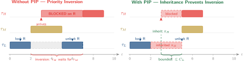

# Real-Time Operating Systems

## Week 7 — Priority Inversion; PIP / PCP / SRP

Unbounded inversion · Mars Pathfinder · three synchronisation protocols

<div class="pt-10 opacity-70 text-sm">
  KMUTNB · Faculty of Engineering · M.Eng. in Electrical & Computer Engineering
</div>

<div class="abs-br m-6 text-xs opacity-50">
  Reading: Buttazzo Ch. 7 · Sha et al. (1990)
</div>

---
layout: two-cols
layoutClass: gap-8
---

# From Week 6 to Week 7

Last week: mutexes protect shared resources.

But what happens when a **high-priority task** blocks on a mutex held by a **low-priority task** — and a **medium-priority task** preempts the low one?

::right::

<div class="mt-10 px-5 py-4 rounded-lg bg-red-50 dark:bg-red-900/30 text-sm leading-relaxed">

**The outcome is wrong:**

The high-priority task effectively waits for the medium-priority task — which has nothing to do with the shared resource.

This is **priority inversion** — and it famously crashed the Mars Pathfinder in 1997.

<div class="mt-3 opacity-80">
This week we prove why it happens and study three protocols that bound or eliminate it.
</div>

</div>

---

# Week 7 — Learning Objectives

By the end of this lecture you will be able to:

<v-clicks>

- **Describe** the classic three-task priority inversion scenario and identify why it is dangerous.
- **Explain** the Mars Pathfinder incident and the fix applied in flight.
- **Describe** the Basic Priority Inheritance Protocol (PIP) and state its blocking bound.
- **Describe** the Priority Ceiling Protocol (PCP) and explain how it prevents deadlock.
- **Distinguish** SRP from PCP and explain its stack-sharing advantage.
- **Configure** FreeRTOS mutexes for priority inheritance and observe the fix in SystemView.

</v-clicks>

<div v-click class="mt-6 px-4 py-2 border-l-4 border-amber-500 bg-amber-50 dark:bg-amber-900/20 text-sm">
Maps to <b>CLO 2 &amp; CLO 3</b> — design safe task interactions; analyse synchronisation correctness.
</div>

---
layout: section
---

# Part 1
## The Priority Inversion Problem

---
layout: statement
---

# Three Tasks, One Mutex, One Problem

τH blocks on τL's mutex. τM preempts τL. τH now waits for τM.

<div class="mt-8 text-base opacity-80 max-w-2xl mx-auto">
A medium-priority task that has <b>nothing to do with the shared resource</b>
delays the highest-priority task. The delay is <b>unbounded</b> — τM can run
for as long as it likes before τH gets the CPU.
</div>

---

# The Inversion Timeline

<div class="my-4 flex justify-center">

</div>

<div class="grid grid-cols-2 gap-4 text-xs mt-1">

<div class="px-3 py-2 rounded bg-red-50 dark:bg-red-900/30">
<b>Left — no fix:</b> τL acquires R, τH arrives and blocks on R. τM preempts τL. τH waits for τM to finish (unbounded inversion window).
</div>

<div class="px-3 py-2 rounded bg-green-50 dark:bg-green-900/30">
<b>Right — PIP:</b> when τH blocks, τL inherits τH's priority. τM cannot preempt τL. τL completes, τH runs. Blocking bounded to one τL critical section.
</div>

</div>

---
layout: section
---

# Part 2
## Mars Pathfinder — A Real Inversion

---
layout: two-cols
layoutClass: gap-6
---

# Mars Pathfinder (1997)

The Sojourner rover's on-board computer began resetting itself repeatedly, several days into the mission.

**Root cause:** unbounded priority inversion in VxWorks.

<v-clicks>

- **Low-priority**: meteorology task collects data, holds the ASI/MET bus mutex
- **High-priority**: `bc_dist` task needs the bus, blocks on mutex
- **Medium-priority**: communications task preempts the meteorology task
- **Watchdog**: `bc_dist` does not run for too long → system reset

Priority inheritance was implemented in VxWorks but **not enabled** on that mutex.

</v-clicks>

::right::

<div class="mt-10 px-5 py-4 rounded-lg bg-amber-50 dark:bg-amber-900/30 text-sm leading-relaxed">

**The fix — applied from Earth**

Engineers uploaded a parameter change to enable priority inheritance on the mutex. No new binary — just a configuration flag.

<div class="mt-3">
The resets stopped immediately. The rover resumed normal operations.
</div>

<div class="mt-3 opacity-80">
Lesson: always enable priority inheritance on shared-resource mutexes in fixed-priority RTOS systems. It is a correctness property, not an optimisation.
</div>

</div>

---
layout: section
---

# Part 3
## Basic Priority Inheritance Protocol (PIP)

---

# PIP — How It Works

**Rule:** when a high-priority task τH blocks on a resource held by τL, τL **inherits** τH's priority until it releases the resource.

<div class="mt-4 text-sm">

| Event | Action |
|-------|--------|
| τH attempts to lock R held by τL | τL's priority raised to τH's priority |
| τL releases R | τL's priority restored to its original level |
| τH acquires R | τH runs at its own priority |
| Chained blocking (τH→τM→τL) | Priority propagates through the chain |

</div>

<div v-click class="mt-4 grid grid-cols-2 gap-4 text-sm">

<div class="px-4 py-3 rounded bg-green-50 dark:bg-green-900/30">
<div class="font-bold">Blocking bound</div>
<div class="mt-1">Each high-priority task is blocked by at most <b>one critical section</b> of each lower-priority task — one per distinct resource it competes for.</div>
</div>

<div class="px-4 py-3 rounded bg-amber-50 dark:bg-amber-900/30">
<div class="font-bold">Limitations</div>
<div class="mt-1">Does not prevent <b>deadlock</b> (τA holds R1, waits for R2; τB holds R2, waits for R1). Does not prevent <b>chained blocking</b> (though it bounds each link).</div>
</div>

</div>

---

# PIP in FreeRTOS

FreeRTOS implements a simplified priority inheritance on `xSemaphoreCreateMutex()`.

```c {all|1-3|5-12|14-18}
/* Enable in FreeRTOSConfig.h */
#define configUSE_MUTEXES  1

/* Create a mutex — PIP is automatic */
SemaphoreHandle_t xBusMutex = xSemaphoreCreateMutex();

void vLowPriorityTask(void *pv) {
    xSemaphoreTake(xBusMutex, portMAX_DELAY);
    /* critical section — if higher-priority task arrives,
       this task's priority is temporarily boosted */
    vAccessSharedBus();
    xSemaphoreGive(xBusMutex);
}

/* FreeRTOS PIP note: inheritance applies to the DIRECTLY
   blocking task only. Chained inheritance is NOT
   fully propagated in the current FreeRTOS implementation.
   For chained scenarios, use a design that avoids nesting. */
```

---
layout: section
---

# Part 4
## Priority Ceiling Protocol (PCP)

---
layout: two-cols
layoutClass: gap-6
---

# PCP — The Ceiling Idea

Each resource R is assigned a **priority ceiling** $\pi(R)$: the **maximum priority** of any task that can lock R (computed offline).

**Locking rule:** task τ can lock R only if τ's priority is **strictly higher** than the ceiling of every currently locked resource held by any other task.

<v-clicks>

If the condition fails, τ blocks — even if R itself is free. This prevents the scenario that leads to deadlock.

**Effect:**
- At most **one blocking** per high-priority task per activation
- **No deadlock** — impossible to acquire resources in a way that creates cycles
- **No chained blocking** — the global ceiling check cuts the chain

</v-clicks>

::right::

<div class="mt-10 px-5 py-4 rounded-lg bg-blue-50 dark:bg-blue-900/30 text-sm leading-relaxed">

### PCP Example

Resources R1, R2. Tasks: τH (prio 3), τM (prio 2), τL (prio 1).

Only τH uses R1 → ceiling π(R1) = 3.
τH and τL use R2 → ceiling π(R2) = 3.

τL locks R2. τM arrives, tries R2 — blocked (π(R2) = 3 = τH's priority, not strictly above). τH arrives, takes R2 immediately from τL. No inversion.

<div class="mt-3 opacity-80 text-xs">
The strict inequality rule is the key — it forces all tasks to "queue up" behind the ceiling.
</div>

</div>

---
layout: section
---

# Part 5
## Stack Resource Policy (SRP)

---

# SRP — Baker (1991)

The Stack Resource Policy combines PCP-like blocking prevention with a unique advantage: tasks sharing a stack frame.

<div class="mt-4 grid grid-cols-3 gap-4 text-sm">

<div class="px-4 py-4 rounded-lg bg-blue-50 dark:bg-blue-900/30">
<div class="font-bold text-blue-700 dark:text-blue-300">Single blocking point</div>
<div class="mt-2">Each task blocks at most <b>once</b>, at its <b>activation</b> (before it starts running). Never blocks mid-execution.</div>
</div>

<div class="px-4 py-4 rounded-lg bg-green-50 dark:bg-green-900/30">
<div class="font-bold text-green-700 dark:text-green-300">Stack sharing</div>
<div class="mt-2">Because a task never blocks mid-run, it runs to completion or suspension — its stack frame can be shared or reused. Reduces total stack usage.</div>
</div>

<div class="px-4 py-4 rounded-lg bg-amber-50 dark:bg-amber-900/30">
<div class="font-bold text-amber-700 dark:text-amber-300">Used in OSEK/AUTOSAR</div>
<div class="mt-2">OSEK OS (automotive) uses SRP. Tasks are called "basic tasks" and use a single shared stack. Critical sections use resource ceilings.</div>
</div>

</div>

<div v-click class="mt-5 text-sm px-4 py-2 border-l-4 border-blue-700 bg-blue-50 dark:bg-blue-900/20">
SRP is the most efficient protocol for stack usage and blocking, but requires offline computation of preemption levels (analogous to ceilings). FreeRTOS does not implement SRP — it uses PIP only.
</div>

---

# Protocol Comparison

<div class="mt-4 text-sm">

| Property | PIP | PCP | SRP |
|----------|-----|-----|-----|
| Prevents deadlock | No | Yes | Yes |
| Max blocking per task | one CS per resource | one CS total | zero mid-execution |
| Chained blocking | possible | prevented | prevented |
| Stack sharing | No | No | Yes |
| Online computation | Yes (dynamic) | Partial | Offline only |
| FreeRTOS support | Yes (mutex) | No | No |
| Used in | FreeRTOS, VxWorks | POSIX PRIO_PROTECT | OSEK/AUTOSAR |

</div>

<div v-click class="mt-4 text-sm px-4 py-2 border-l-4 border-amber-500 bg-amber-50 dark:bg-amber-900/20">
For FreeRTOS projects: use mutexes (PIP). Design to avoid nested locking when possible. Document ceiling values even if not enforced — it is an invariant of your design.
</div>

---
layout: section
---

# Part 6
## Lab 4 — Priority Inversion Demonstration

---
layout: two-cols
layoutClass: gap-6
---

# Lab 4 — See It, Fix It

Reproduce priority inversion in hardware, observe it in SystemView, then fix it.

<v-clicks>

**Step 1 — Reproduce:**
1. Create τH (prio 3), τM (prio 2), τL (prio 1)
2. τL takes a binary semaphore (no PIP), runs for 20 ms
3. τH starts 5 ms later, tries to take the same semaphore — blocks
4. τM runs at prio 2, consuming 15 ms of CPU
5. Record SystemView trace — τH finishes much later than expected

**Step 2 — Fix:**
6. Replace binary semaphore with `xSemaphoreCreateMutex()`
7. Record new trace — τL now runs at τH's priority, τM cannot preempt

</v-clicks>

::right::

<div class="mt-8 px-5 py-4 rounded-lg bg-amber-50 dark:bg-amber-900/30 text-sm leading-relaxed">

**What the trace should show**

Without PIP: τH's response time = τL's blocked time + τM's runtime.

With PIP (mutex): τH's response time ≤ τL's critical section. τM runs after τH completes.

<div class="mt-3">
If you can't see the difference in SystemView, reduce task periods to make the inversion window larger.
</div>

<div class="mt-3 text-xs opacity-70">
Reading — Buttazzo §7.1–7.3 · Sha, Rajkumar &amp; Lehoczky (1990)
</div>

</div>

---
layout: default
---

# Key Takeaways

<v-clicks>

- **Priority inversion** occurs when a medium-priority task delays a high-priority task via a low-priority mutex holder. The delay is **unbounded** without a protocol.
- **Mars Pathfinder** is the canonical industrial example — fixed with a one-line configuration change enabling priority inheritance.
- **PIP** (Basic Priority Inheritance): the mutex holder inherits the blocker's priority. Simple, dynamic, supported by FreeRTOS. Does not prevent deadlock.
- **PCP** assigns offline priority ceilings to resources; no task blocks mid-execution. Prevents deadlock and chained blocking.
- **SRP** (Stack Resource Policy) is the most efficient: single blocking point, enables stack sharing. Used in OSEK/AUTOSAR.
- **FreeRTOS**: use `xSemaphoreCreateMutex()`, not binary semaphores, whenever priority-related blocking is possible.

</v-clicks>

<div v-click class="mt-5 text-center text-base px-4 py-2 rounded bg-blue-100 dark:bg-blue-900/40">
Next week — <b>Deadlock, Livelock &amp; Watchdogs</b>: when synchronisation goes permanently wrong.
</div>

---

# Before Next Week

<div class="grid grid-cols-2 gap-8 mt-6">

<div>

### Reading
- **Buttazzo**, Ch. 7.1–7.3 — priority inversion protocols
- **Sha, Rajkumar &amp; Lehoczky (1990)** — "Priority inheritance protocols: an approach to real-time synchronization" (*IEEE Trans. Computers*)

### Lab
- Complete **Lab 4** — run both traces (with and without PIP)
- Calculate τH's theoretical worst-case response time in both cases
- Verify against SystemView measurements

</div>

<div>

### Check yourself
<div class="text-sm">

1. Draw a three-task timing diagram showing priority inversion. Label the inversion window.
2. What property of PIP prevents it from fully eliminating chained blocking?
3. A task set has three resources. Under PCP, what is the maximum number of times a task can block during one activation?
4. Why can FreeRTOS's mutex PIP "break" if you use a binary semaphore given from an ISR instead of a mutex given from a task?

</div>

</div>

</div>

---
layout: end
class: text-center
---

# Week 7 Complete

Priority Inversion; PIP / PCP / SRP

<div class="mt-4 text-sm opacity-70">
Real-Time Operating Systems · KMUTNB · M.Eng. ECE<br/>
Next — Week 8 · Deadlock, Livelock &amp; Watchdogs
</div>

<style>
:root { --slidev-theme-primary: #003874; }
.slidev-layout h1 { color: #003874; }
.dark .slidev-layout h1 { color: #7ba7d9; }
table { font-size: 0.92em; }
</style>
