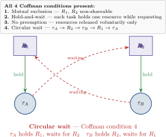

# Real-Time Operating Systems

## Week 8 — Deadlock, Livelock &amp; Watchdogs

Coffman conditions · prevention strategies · hardware watchdog on MCXN236

<div class="pt-10 opacity-70 text-sm">
  KMUTNB · Faculty of Engineering · M.Eng. in Electrical & Computer Engineering
</div>

<div class="abs-br m-6 text-xs opacity-50">
  Reading: Buttazzo Ch. 7 · NXP MCXN236 RM Ch. WDOG
</div>

---
layout: two-cols
layoutClass: gap-8
---

# From Week 7 to Week 8

PIP/PCP prevent **priority inversion** and (PCP) prevent **deadlock** on resources.

But deadlock can arise from:
- multiple mutexes taken in different orders
- semaphores used incorrectly
- tasks waiting for each other to complete

And even if we prevent deadlock, systems can still **livelock** or **starve** a low-priority task forever.

::right::

<div class="mt-10 px-5 py-4 rounded-lg bg-blue-50 dark:bg-blue-900/30 text-sm leading-relaxed">

**This week — when things go permanently wrong:**

- **Deadlock**: 4 Coffman conditions, detection, prevention
- **Livelock**: activity without progress
- **Starvation**: perpetual deprivation
- **Watchdog timers**: the hardware last resort
- **FreeRTOS watchdog pattern**: software task monitor

</div>

---

# Week 8 — Learning Objectives

By the end of this lecture you will be able to:

<v-clicks>

- **State** the four Coffman conditions for deadlock and explain each one.
- **Draw** a resource allocation graph and identify cycles.
- **Apply** deadlock prevention by resource ordering.
- **Distinguish** deadlock, livelock, and starvation with examples.
- **Configure** the MCXN236 hardware watchdog and implement a kick pattern.
- **Design** a software watchdog in FreeRTOS using task notifications.

</v-clicks>

<div v-click class="mt-6 px-4 py-2 border-l-4 border-amber-500 bg-amber-50 dark:bg-amber-900/20 text-sm">
Maps to <b>CLO 2 &amp; CLO 3</b> — design safe task interactions and analyse system correctness.
</div>

---
layout: section
---

# Part 1
## Deadlock — Conditions and Detection

---
layout: statement
---

# The Coffman Conditions

Deadlock requires ALL FOUR conditions simultaneously. Remove one — deadlock is impossible.

---

# Four Coffman Conditions

<div class="mt-4 grid grid-cols-2 gap-5 text-sm">

<div class="px-4 py-4 rounded-lg border-2 border-red-400 bg-red-50 dark:bg-red-900/20">
<div class="text-base font-bold text-red-700 dark:text-red-300">1. Mutual Exclusion</div>
<div class="mt-2">At least one resource can be held by only one task at a time. Most shared resources satisfy this by design (mutex).</div>
</div>

<div class="px-4 py-4 rounded-lg border-2 border-red-400 bg-red-50 dark:bg-red-900/20">
<div class="text-base font-bold text-red-700 dark:text-red-300">2. Hold and Wait</div>
<div class="mt-2">A task holding at least one resource is waiting to acquire additional resources held by other tasks.</div>
</div>

<div class="px-4 py-4 rounded-lg border-2 border-red-400 bg-red-50 dark:bg-red-900/20">
<div class="text-base font-bold text-red-700 dark:text-red-300">3. No Preemption</div>
<div class="mt-2">Resources cannot be forcibly taken — they must be voluntarily released by the holding task.</div>
</div>

<div class="px-4 py-4 rounded-lg border-2 border-red-400 bg-red-50 dark:bg-red-900/20">
<div class="text-base font-bold text-red-700 dark:text-red-300">4. Circular Wait</div>
<div class="mt-2">There is a circular chain: Task A waits for a resource held by Task B, which waits for a resource held by A.</div>
</div>

</div>

<div v-click class="mt-4 text-sm px-4 py-2 border-l-4 border-blue-700 bg-blue-50 dark:bg-blue-900/20">
Breaking <b>circular wait</b> is the most practical prevention strategy: impose a global ordering on all resources and require every task to acquire them in that order.
</div>

---

# Resource Allocation Graph

Circles = tasks. Squares = resources. Arrow from task to resource = waiting. Arrow from resource to task = holding.

<div class="mt-4 grid grid-cols-2 gap-6 text-sm">

<div class="px-4 py-3 rounded bg-red-50 dark:bg-red-900/30">
<div class="font-bold">Deadlock: cycle present</div>
<div class="mt-2 font-mono text-xs">
A → R1 → B → R2 → A<br/>
(A holds R2, waits for R1;<br/>
 B holds R1, waits for R2)
</div>
<div class="mt-2 opacity-80">Both tasks wait forever. No progress possible without external intervention.</div>
</div>

<div class="px-4 py-3 rounded bg-green-50 dark:bg-green-900/30">
<div class="font-bold">No deadlock: no cycle</div>
<div class="mt-2 font-mono text-xs">
A → R1 → B<br/>
C → R2 → D<br/>
(no circular dependency)
</div>
<div class="mt-2 opacity-80">Tasks A and C will eventually get their resources when B and D release them.</div>
</div>

</div>

---

# Deadlock — Resource Allocation Graph

<div class="my-3 flex justify-center">

</div>

---
layout: section
---

# Part 2
## Prevention Strategies

---

# Breaking Circular Wait — Resource Ordering

The simplest and most practical deadlock prevention: assign a **total order** to all resources. Every task must acquire resources in **increasing order** only.

```c
/* Define resource order (compile-time constants) */
#define LOCK_ORDER_SPI_BUS   1
#define LOCK_ORDER_UART      2
#define LOCK_ORDER_FLASH     3

/* Correct: always acquire lower-order resources first */
void vTaskA(void *pv) {
    xSemaphoreTake(xSpiBus,  portMAX_DELAY);  /* order 1 */
    xSemaphoreTake(xFlash,   portMAX_DELAY);  /* order 3 */
    /* use both */
    xSemaphoreGive(xFlash);
    xSemaphoreGive(xSpiBus);
}

/* WRONG — acquires in reverse order, can deadlock with vTaskA */
void vTaskB_wrong(void *pv) {
    xSemaphoreTake(xFlash,   portMAX_DELAY);  /* order 3 first! */
    xSemaphoreTake(xSpiBus,  portMAX_DELAY);  /* order 1 second */
}
```

<div v-click class="mt-3 text-sm px-4 py-2 border-l-4 border-green-500 bg-green-50 dark:bg-green-900/20">
Document resource order in FreeRTOSConfig.h or a system header. Make it a code-review checklist item.
</div>

---

# Other Prevention Approaches

<div class="mt-4 grid grid-cols-3 gap-4 text-sm">

<div class="px-4 py-3 rounded-lg bg-gray-100 dark:bg-gray-800">
<div class="font-bold">Break Hold-and-Wait</div>
<div class="mt-2">Require each task to acquire ALL needed resources atomically at the start. If any is unavailable, release all and retry. Practical for small resource sets.</div>
</div>

<div class="px-4 py-3 rounded-lg bg-gray-100 dark:bg-gray-800">
<div class="font-bold">Allow Preemption</div>
<div class="mt-2">If a task cannot get R2, release R1 and retry later. Only works for resources whose state can be safely saved and restored — rare in RTOS peripherals.</div>
</div>

<div class="px-4 py-3 rounded-lg bg-blue-50 dark:bg-blue-900/30">
<div class="font-bold">Use PCP</div>
<div class="mt-2">Priority Ceiling Protocol (Week 7) prevents circular wait by design. The ceiling rule ensures no two tasks can be mid-critical-section simultaneously.</div>
</div>

</div>

<div v-click class="mt-5 text-sm px-4 py-2 border-l-4 border-amber-500 bg-amber-50 dark:bg-amber-900/20">
In practice: <b>resource ordering</b> is the go-to tool. It is static, cheap, and enforced by code review. PCP adds runtime guarantees but requires offline analysis.
</div>

---
layout: section
---

# Part 3
## Livelock and Starvation

---

# Livelock

Tasks are **active** but make **no progress** — each is responding to the other's state changes, but neither advances.

```c
/* Classic livelock — two tasks "politely" yield to each other */
void vTaskA(void *pv) {
    for (;;) {
        if (xSemaphoreTake(xR1, 0)) {          /* try R1 */
            if (!xSemaphoreTake(xR2, 0)) {      /* try R2 */
                xSemaphoreGive(xR1);            /* give back R1, retry */
                vTaskDelay(1);                  /* "polite" backoff */
            } else {
                /* have both — do work */
                xSemaphoreGive(xR2);
                xSemaphoreGive(xR1);
            }
        }
    }
}
/* TaskB is symmetric — both keep giving back and retrying, forever */
```

<div v-click class="mt-3 text-sm px-4 py-2 border-l-4 border-amber-500 bg-amber-50 dark:bg-amber-900/20">
Fix: randomised backoff (like Ethernet CSMA/CD), or a central arbitrator, or PCP-style pre-acquisition.
</div>

---

# Starvation

A task is **perpetually denied** access to a resource because higher-priority tasks always preempt it.

<div class="mt-4 grid grid-cols-2 gap-6 text-sm">

<div class="px-4 py-3 rounded-lg bg-amber-50 dark:bg-amber-900/30">
<div class="font-bold">In FreeRTOS</div>
<div class="mt-2">The idle task (priority 0) can starve if all priority-1+ tasks are always runnable. Any task can starve if higher-priority tasks never yield or block.</div>
</div>

<div class="px-4 py-3 rounded-lg bg-blue-50 dark:bg-blue-900/30">
<div class="font-bold">Mitigation</div>
<div class="mt-2">FreeRTOS doesn't implement aging (gradually increase priority). Design solution: ensure high-priority tasks block on I/O frequently, leaving time for lower priorities.</div>
</div>

</div>

<div v-click class="mt-5 text-sm px-4 py-2 border-l-4 border-blue-700 bg-blue-50 dark:bg-blue-900/20">
Verify with SystemView: check that every task appears in the trace at some point. A task that never runs in a one-second trace window is likely starving.
</div>

---
layout: section
---

# Part 4
## Watchdog Timers

---
layout: statement
---

# The Hardware Guardian

A watchdog timer resets the system if software does not "kick" it within a timeout.

<div class="mt-8 text-base opacity-80 max-w-2xl mx-auto">
The watchdog is the final safety net. No matter what software bug, deadlock, or stack corruption has occurred — if the watchdog is not kicked, the system resets to a known-good state. Required by IEC 61508 SIL-2+ and ISO 26262 ASIL-C+.
</div>

---

# MCXN236 Watchdog — WDOG

The MCXN236 has a 32-bit window watchdog (WDOG0/WDOG1).

```c {all|1-10|12-18|20-25}
#include "fsl_wdog32.h"

/* Configure watchdog: 500 ms timeout, cannot be disabled after lock */
void vWatchdogInit(void)
{
    wdog32_config_t cfg;
    WDOG32_GetDefaultConfig(&cfg);
    cfg.timeoutValue = 0x4000;      /* ~500 ms at LPO 128 Hz clock */
    cfg.enableWdog   = true;
    WDOG32_Init(WDOG0, &cfg);
}

/* Must be called at least once per 500 ms */
void vWatchdogKick(void)
{
    WDOG32_Refresh(WDOG0);
}

/* Optional: watchdog interrupt before reset */
void WDOG0_IRQHandler(void)
{
    /* Log last known state, save context to non-volatile memory */
    /* System will reset in one more timeout cycle */
    WDOG32_ClearStatusFlags(WDOG0, kWDOG32_InterruptFlag);
}
```

---
layout: section
---

# Part 5
## FreeRTOS Software Watchdog Pattern

---

# Software Watchdog — Multi-Task Health Check

A single hardware watchdog cannot distinguish which task is stuck. A software watchdog layer monitors **each task individually**.

```c {all|1-5|7-17|19-27}{maxHeight:'320px'}
/* Each critical task has a task notification "heartbeat" */
#define NUM_MONITORED_TASKS  3
static TaskHandle_t xMonitoredTasks[NUM_MONITORED_TASKS];

/* Register task at creation */
xMonitoredTasks[0] = xSensorTaskHandle;

void vSensorTask(void *pv) {
    for (;;) {
        /* Do work ... */
        vReadSensors();
        /* Signal the watchdog we are alive */
        xTaskNotifyGive(xWatchdogTask);
        vTaskDelayUntil(&xLast, pdMS_TO_TICKS(100));
    }
}

/* Watchdog task (highest priority in system) */
void vWatchdogTask(void *pv)
{
    for (;;) {
        /* Expect notification from each monitored task within window */
        for (int i = 0; i < NUM_MONITORED_TASKS; i++) {
            uint32_t notif = ulTaskNotifyTake(pdTRUE,
                                pdMS_TO_TICKS(200));
            if (notif == 0) {
                /* Task i missed its heartbeat — log and reset */
                vLogFatalError(i);
                NVIC_SystemReset();
            }
        }
        vWatchdogKick();   /* hardware kick only if all tasks healthy */
    }
}
```

---
layout: section
---

# Part 6
## Lab 5 — Watchdog Demo

---
layout: two-cols
layoutClass: gap-6
---

# Lab 5 — Watchdog in Action

Demonstrate both hardware watchdog and the software monitoring pattern.

<v-clicks>

**Step 1 — Hardware watchdog:**
1. Configure WDOG0 with a 1-second timeout
2. Create a "healthy" task that kicks every 500 ms → system stable
3. Introduce a `vTaskDelay(2000)` bug → watchdog fires → LED blink on reset
4. Observe reset counter in non-volatile SRAM

**Step 2 — Software watchdog:**
5. Create two "sensor" tasks that call `xTaskNotifyGive`
6. Watchdog task: collects notifications, kicks hardware
7. Simulate one sensor task "hanging" with an infinite loop
8. Observe watchdog isolating and logging the stuck task

</v-clicks>

::right::

<div class="mt-8 px-5 py-4 rounded-lg bg-amber-50 dark:bg-amber-900/30 text-sm leading-relaxed">

**Production patterns**

In a real product:
- Store reset cause in battery-backed SRAM or EEPROM
- Log the identity of the failing task
- Implement safe-state logic before reset (stop motors, close valves)
- Use a window watchdog (WDOG with minimum refresh time) to catch both too-slow AND too-fast kicks

<div class="mt-3 text-xs opacity-70">
Reading — NXP MCXN236 Reference Manual, WDOG chapter
</div>

</div>

---
layout: default
---

# Key Takeaways

<v-clicks>

- **Deadlock** requires all four Coffman conditions simultaneously. Breaking any one prevents it; resource ordering (breaking circular wait) is the most practical approach.
- A **resource allocation graph** with a cycle indicates deadlock. Without a cycle, no deadlock.
- **Livelock** is subtler than deadlock — tasks are active but make no progress. Randomised backoff or centralised arbitration cures it.
- **Starvation** can occur even without deadlock; verify with traces that low-priority tasks actually run.
- **Hardware watchdog timers** are mandatory for production RTOS systems — the last resort against runaway tasks and stack corruption.
- A **software watchdog layer** extends the hardware watchdog to detect per-task failures and log which task was stuck.

</v-clicks>

<div v-click class="mt-5 text-center text-base px-4 py-2 rounded bg-blue-100 dark:bg-blue-900/40">
Module 3 complete. Next — <b>Module 4: Timing Analysis &amp; Memory</b>. Week 9: WCET and the DWT cycle counter.
</div>

---

# Before Next Week

<div class="grid grid-cols-2 gap-8 mt-6">

<div>

### Reading
- **Buttazzo**, Ch. 7.4–7.6 — deadlock avoidance
- **NXP MCXN236 Reference Manual** — WDOG chapter
- Review: FreeRTOS `xTaskNotifyGive` / `ulTaskNotifyTake` API

### Lab
- Complete **Lab 5 — Watchdog**
- Verify reset cause is persisted across reboots
- Measure reset-to-re-init time in SystemView

</div>

<div>

### Check yourself
<div class="text-sm">

1. Draw a resource allocation graph for two tasks and two resources in deadlock. Which Coffman condition is most visible in your diagram?
2. Why does resource ordering break the circular-wait condition?
3. A watchdog timeout is 500 ms. Your highest-priority task runs every 10 ms. Can that task starve the watchdog-kick task? What priority must the watchdog task have?
4. What is the difference between a window watchdog and a simple timeout watchdog? What bug does the window variant catch that a simple watchdog misses?

</div>

</div>

</div>

---
layout: end
class: text-center
---

# Week 8 Complete

Deadlock, Livelock &amp; Watchdogs

<div class="mt-4 text-sm opacity-70">
Real-Time Operating Systems · KMUTNB · M.Eng. ECE<br/>
Next — Week 9 · WCET; DWT Cycle Counter; Interrupt Latency
</div>

<style>
:root { --slidev-theme-primary: #003874; }
.slidev-layout h1 { color: #003874; }
.dark .slidev-layout h1 { color: #7ba7d9; }
table { font-size: 0.92em; }
</style>
