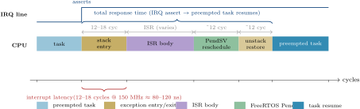

# Real-Time Operating Systems

## Week 9 — WCET; DWT Cycle Counter; Interrupt Latency

Timing analysis · cycle-accurate profiling · ISR overhead on Cortex-M33

<div class="pt-10 opacity-70 text-sm">
  KMUTNB · Faculty of Engineering · M.Eng. in Electrical & Computer Engineering
</div>

<div class="abs-br m-6 text-xs opacity-50">
  Reading: Wilhelm et al. (2008) "The worst-case execution time problem" · ARM Cortex-M33 TRM
</div>

---
layout: two-cols
layoutClass: gap-8
---

# From Module 3 to Module 4

Modules 1–3 assumed **Cᵢ is given**. Where does it come from?

Every schedulability proof we ran used WCET as an input — but we never asked how to obtain it.

<v-clicks>

Without a sound Cᵢ:
- The utilization bound may be violated at runtime
- RTA results are meaningless
- Deadline guarantees collapse

</v-clicks>

::right::

<div class="mt-10 px-5 py-4 rounded-lg bg-blue-50 dark:bg-blue-900/30 text-sm leading-relaxed">

**This week — measure execution time on real hardware:**

- What WCET analysis means and why it's hard
- Measurement-based WCET with the DWT cycle counter
- Interrupt latency: sources and measurement
- FreeRTOS interrupt priority architecture
- Lab 6: DWT profiling on FRDM-MCXN236

</div>

---

# Week 9 — Learning Objectives

By the end of this lecture you will be able to:

<v-clicks>

- **Explain** why WCET is hard to measure and the difference between measurement-based and static analysis.
- **Enable and read** the DWT cycle counter on ARM Cortex-M33.
- **Measure** worst-case execution time of a C function with cycle-level precision.
- **Explain** the components of ARM Cortex-M interrupt latency.
- **Configure** `configMAX_SYSCALL_INTERRUPT_PRIORITY` correctly for FreeRTOS ISRs.
- **Quantify** interrupt-added jitter in a scheduled task.

</v-clicks>

<div v-click class="mt-6 px-4 py-2 border-l-4 border-amber-500 bg-amber-50 dark:bg-amber-900/20 text-sm">
Maps to <b>CLO 1 &amp; CLO 4</b> — timing analysis and measurement methodology.
</div>

---
layout: section
---

# Part 1
## WCET — Why It's Hard

---
layout: statement
---

# The WCET Problem

Find a **safe upper bound** on the execution time of a program for **all possible inputs** and **all possible hardware states**.

<div class="mt-8 text-base opacity-80 max-w-2xl mx-auto">
The hardware state includes: cache contents, branch predictor state, pipeline fill, memory bus arbitration. These are input-dependent and context-dependent — the same code can take 10× longer depending on cache state alone.
</div>

---

# Two Approaches to WCET

<div class="mt-4 grid grid-cols-2 gap-6 text-sm">

<div class="px-4 py-4 rounded-lg border-2 border-blue-400 bg-blue-50 dark:bg-blue-900/20">
<div class="text-base font-bold text-blue-700 dark:text-blue-300">Measurement-based</div>
<div class="mt-2">Execute with many inputs (including worst-case scenarios). Record maximum observed time. Add a safety margin (10–20 %).</div>
<div class="mt-3 font-bold text-amber-600">Pros:</div>
<div>Simple, hardware-accurate, low tool cost</div>
<div class="mt-1 font-bold text-red-600">Cons:</div>
<div>Not sound — may miss the true worst case. Not accepted for DAL-A (DO-178C) certification.</div>
</div>

<div class="px-4 py-4 rounded-lg border-2 border-green-400 bg-green-50 dark:bg-green-900/20">
<div class="text-base font-bold text-green-700 dark:text-green-300">Static analysis (SSTA/IPET)</div>
<div class="mt-2">Abstract interpretation of the binary on a hardware timing model. Tools: aiT (AbsInt), Bound-T, SWEET.</div>
<div class="mt-3 font-bold text-green-600">Pros:</div>
<div>Sound — guaranteed upper bound. Accepted for safety certification.</div>
<div class="mt-1 font-bold text-amber-600">Cons:</div>
<div>Expensive, requires hardware timing model, can be very pessimistic.</div>
</div>

</div>

<div v-click class="mt-4 text-sm px-4 py-2 border-l-4 border-blue-700 bg-blue-50 dark:bg-blue-900/20">
This course uses <b>measurement-based WCET</b> with the DWT cycle counter — sufficient for research and most industrial use cases below SIL-3/ASIL-D.
</div>

---
layout: section
---

# Part 2
## The DWT Cycle Counter

---
layout: two-cols
layoutClass: gap-6
---

# DWT — Data Watchpoint and Trace

The DWT is part of the ARM CoreSight debug infrastructure, available on all Cortex-M3/M4/M7/M33.

**Key registers:**

| Register | Address | Purpose |
|----------|---------|---------|
| `CoreDebug->DEMCR` | 0xE000EDFC | Bit 24 (TRCENA): enable DWT |
| `DWT->CTRL` | 0xE0001000 | Bit 0 (CYCCNTENA): enable counter |
| `DWT->CYCCNT` | 0xE0001004 | 32-bit cycle counter |

```c
/* Enable DWT cycle counter */
void DWT_Init(void)
{
    CoreDebug->DEMCR |=
        CoreDebug_DEMCR_TRCENA_Msk;
    DWT->CYCCNT = 0;
    DWT->CTRL  |=
        DWT_CTRL_CYCCNTENA_Msk;
}
```

::right::

<div class="mt-8 px-5 py-4 rounded-lg bg-blue-50 dark:bg-blue-900/30 text-sm leading-relaxed">

### Measuring execution time

```c
uint32_t DWT_MeasureCycles(
    void (*fn)(void))
{
    DWT->CYCCNT = 0;
    __DSB();  /* complete pending memory ops */
    __ISB();  /* flush pipeline */
    fn();
    __DSB();
    uint32_t cycles = DWT->CYCCNT;
    return cycles;
}

/* Usage */
uint32_t worst = 0;
for (int i = 0; i < 10000; i++) {
    load_worst_case_input(i);
    uint32_t c = DWT_MeasureCycles(
                     myTask_body);
    if (c > worst) worst = c;
}
/* worst * (1.0f / SystemCoreClock) = WCET */
```

</div>

---

# DWT Pitfalls

<div class="mt-4 grid grid-cols-3 gap-4 text-sm">

<div class="px-4 py-3 rounded-lg bg-amber-50 dark:bg-amber-900/30">
<div class="font-bold">Interrupt contamination</div>
<div class="mt-2">If an ISR fires during measurement, the cycle count includes ISR cycles. Disable interrupts (taskENTER_CRITICAL) for a clean measurement — but this changes the cache state.</div>
</div>

<div class="px-4 py-3 rounded-lg bg-amber-50 dark:bg-amber-900/30">
<div class="font-bold">Counter rollover</div>
<div class="mt-2">DWT->CYCCNT is 32-bit. At 150 MHz it rolls over after ~28 seconds. For tasks &lt;1 ms this is not a concern. Use 64-bit accumulation for long tasks.</div>
</div>

<div class="px-4 py-3 rounded-lg bg-amber-50 dark:bg-amber-900/30">
<div class="font-bold">Cache warm-up</div>
<div class="mt-2">First execution of a function may be slow (cold cache). Measure after at least one warm-up run to capture the steady-state worst case.</div>
</div>

</div>

<div v-click class="mt-5 text-sm px-4 py-2 border-l-4 border-blue-700 bg-blue-50 dark:bg-blue-900/20">
MCXN236 Cortex-M33 has <b>no data cache</b> — flash access latency is deterministic (configurable wait states). This simplifies WCET measurement significantly compared to Cortex-A cores.
</div>

---
layout: section
---

# Part 3
## Interrupt Latency

---

# Components of Interrupt Latency

<div class="my-3 flex justify-center">

</div>

<div class="mt-3 text-sm px-4 py-2 border-l-4 border-blue-700 bg-blue-50 dark:bg-blue-900/20">
Interrupt latency = IRQ assert → first ISR instruction (12–18 cycles). Full response latency adds ISR body + PendSV reschedule + context restore. The FreeRTOS BASEPRI mask can add more if the IRQ priority is below <code>configMAX_SYSCALL_INTERRUPT_PRIORITY</code>.
</div>

---
layout: section
---

# Part 4
## FreeRTOS Interrupt Architecture

---
layout: two-cols
layoutClass: gap-6
---

# configMAX_SYSCALL_INTERRUPT_PRIORITY

FreeRTOS uses ARM's BASEPRI register to mask interrupts during critical sections.

- **IRQ priority ≤ configMAX_SYSCALL**: masked during critical sections. May call `FromISR` API.
- **IRQ priority > configMAX_SYSCALL**: **never masked** — lowest latency. May **NOT** call any FreeRTOS API.

<div class="mt-4 text-xs bg-gray-100 dark:bg-gray-800 rounded p-3 font-mono">
/* FreeRTOSConfig.h — Cortex-M33, 3-bit priority field */<br/>
#define configMAX_SYSCALL_INTERRUPT_PRIORITY  &nbsp; 160   /* priority 5 of 8 */<br/>
#define configKERNEL_INTERRUPT_PRIORITY  &nbsp;&nbsp;&nbsp;&nbsp;&nbsp;&nbsp; 255   /* lowest (SysTick) */
</div>

::right::

<div class="mt-10 px-5 py-4 rounded-lg bg-amber-50 dark:bg-amber-900/30 text-sm leading-relaxed">

### Priority numbering on ARM

On ARM Cortex-M, **lower number = higher priority**. This is the opposite of FreeRTOS task priorities!

| ARM NVIC priority | Meaning |
|------------------|---------|
| 0 | Highest (non-maskable) |
| 255 | Lowest (SysTick, configKERNEL) |

Set safety-critical ISRs (e.g. emergency stop) to priority 0–4 (above SYSCALL). Set normal ISRs (UART, ADC) to priority ≥ 160 (can call FromISR API).

</div>

---
layout: section
---

# Part 5
## Jitter and Task Response

---

# From IRQ to Task Execution

The full path from hardware event to task code running:

<div class="mt-4 text-sm">

| Step | Time | Tunable? |
|------|------|----------|
| IRQ assertion to ISR entry | 12–18 cycles | No (hardware) |
| ISR body (minimal: give semaphore) | 20–50 cycles | Yes |
| `portYIELD_FROM_ISR` context switch | ~100–200 cycles | No |
| FreeRTOS scheduler overhead | ~50 cycles | No |
| Task woken, first instruction | **Total ≈ 1–5 μs** | Keep ISR short |

</div>

<div v-click class="mt-5 grid grid-cols-2 gap-4 text-sm">

<div class="px-4 py-3 rounded bg-blue-50 dark:bg-blue-900/30">
<div class="font-bold">Minimise ISR body</div>
<div class="mt-1">ISR should only: read hardware register, give semaphore/queue, yield. All processing in the unblocked task. This is the "deferred interrupt processing" pattern.</div>
</div>

<div class="px-4 py-3 rounded bg-amber-50 dark:bg-amber-900/30">
<div class="font-bold">Measure jitter</div>
<div class="mt-1">Jitter = max response time − min response time. Sources: critical section masking, preempting tasks, cache misses. Quantify with DWT + logic analyser.</div>
</div>

</div>

---
layout: section
---

# Part 6
## Lab 6 — DWT Profiling

---
layout: two-cols
layoutClass: gap-6
---

# Lab 6 — Measuring WCET and Latency

<v-clicks>

**Exercise 1 — Function WCET:**
1. Implement a bubble-sort over a 100-element array
2. Use DWT to measure: sorted input (best case), random (average), reverse-sorted (worst case)
3. Compute WCET in cycles and microseconds at 150 MHz
4. Add a 20 % margin — this is your $C_i$ for scheduling

**Exercise 2 — Interrupt latency:**
5. GPIO ISR: immediately toggles an output pin
6. Drive input from a signal generator at 1 kHz
7. Measure input-to-output delay on oscilloscope
8. Compare with theoretical minimum (12–18 cycles)

</v-clicks>

::right::

<div class="mt-8 px-5 py-4 rounded-lg bg-amber-50 dark:bg-amber-900/30 text-sm leading-relaxed">

**What to report**

- Table: best/average/worst cycle counts for 1000 runs
- Histogram (optional): distribution of measured times
- Annotated oscilloscope screenshot showing IRQ→output delay
- Compare latency with and without a critical section active on CM33_0

<div class="mt-3 text-xs opacity-70">
Reading — Wilhelm et al. (2008) TECS paper on WCET · ARM Cortex-M33 Technical Reference Manual §DWT
</div>

</div>

---
layout: default
---

# Key Takeaways

<v-clicks>

- **WCET** is a safe upper bound on execution time — it accounts for all inputs and hardware states. Measurement-based WCET is practical but not guaranteed sound.
- The **DWT CYCCNT** register provides 32-bit cycle-accurate measurement on Cortex-M33. Enable with TRCENA + CYCCNTENA before use.
- Interrupt latency on Cortex-M33 is **12–18 cycles** (~80–120 ns @ 150 MHz) for hardware stacking + vector fetch, before any ISR code executes.
- `configMAX_SYSCALL_INTERRUPT_PRIORITY` defines the boundary: ISRs at or below this level may call FreeRTOS `FromISR` functions; ISRs above it are unmasked and cannot call any FreeRTOS API.
- The **deferred interrupt processing** pattern keeps ISR latency minimal: ISR gives a semaphore/notification, a high-priority task does the real work.

</v-clicks>

<div v-click class="mt-5 text-center text-base px-4 py-2 rounded bg-blue-100 dark:bg-blue-900/40">
Next week — <b>FreeRTOS Memory Management</b>: heap schemes, stack sizing, and the MPU.
</div>

---

# Before Next Week

<div class="grid grid-cols-2 gap-8 mt-6">

<div>

### Reading
- **Wilhelm et al. (2008)** — "The worst-case execution time problem: overview of methods and survey of tools" (*ACM TECS*)
- **ARM Cortex-M33 TRM** — §11 DWT
- **FreeRTOS docs** — Interrupt Management chapter

### Lab
- Complete **Lab 6** — DWT profiling and interrupt latency
- Submit: cycle-count table + oscilloscope screenshot + computed $C_i$

</div>

<div>

### Check yourself
<div class="text-sm">

1. Why is measurement-based WCET not accepted for DO-178C DAL-A certification?
2. You measure a function taking 400–480 cycles across 10,000 runs. What Cᵢ do you assign? Justify your safety margin choice.
3. An ISR is assigned ARM priority 5 (`configMAX_SYSCALL_INTERRUPT_PRIORITY` = 160 = priority 5 in 3-bit field). Can it call `xQueueSendFromISR`? Can it call `xQueueSend`?
4. A critical section holds BASEPRI raised for 500 cycles. What is the added interrupt latency for a masked IRQ? At 150 MHz, how many microseconds?

</div>

</div>

</div>

---
layout: end
class: text-center
---

# Week 9 Complete

WCET; DWT Cycle Counter; Interrupt Latency

<div class="mt-4 text-sm opacity-70">
Real-Time Operating Systems · KMUTNB · M.Eng. ECE<br/>
Next — Week 10 · FreeRTOS Memory Management
</div>

<style>
:root { --slidev-theme-primary: #003874; }
.slidev-layout h1 { color: #003874; }
.dark .slidev-layout h1 { color: #7ba7d9; }
table { font-size: 0.92em; }
</style>
