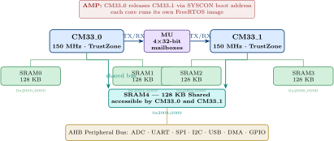

# Real-Time Operating Systems

## Week 12 — Multi-Core AMP vs SMP

Asymmetric vs Symmetric · Mailbox IPC · FreeRTOS SMP · MCXN236 dual-core

<div class="pt-10 opacity-70 text-sm">
  KMUTNB · Faculty of Engineering · M.Eng. in Electrical & Computer Engineering
</div>

<div class="abs-br m-6 text-xs opacity-50">
  Reading: NXP MCXN236 RM §MU · FreeRTOS SMP docs
</div>

---
layout: two-cols
layoutClass: gap-8
---

# From Week 11 to Week 12

We now have hardware security isolation between worlds.

Modern embedded SoCs increasingly have **multiple CPU cores** — but more cores means more scheduling, synchronisation, and communication complexity.

How do we run an RTOS across two cores? And how do we keep real-time guarantees when tasks migrate between processors?

::right::

<div class="mt-10 px-5 py-4 rounded-lg bg-blue-50 dark:bg-blue-900/30 text-sm leading-relaxed">

**This week — multi-core RTOS design:**

- AMP vs SMP models
- MCXN236: dual Cortex-M33 + Messaging Unit (MU)
- Inter-core communication: mailboxes and shared SRAM
- FreeRTOS SMP: one scheduler, N cores
- Cache coherence and memory barriers on multi-core M33
- Lab 9: dual-core producer–consumer with MU mailbox

</div>

---

# Week 12 — Learning Objectives

By the end of this lecture you will be able to:

<v-clicks>

- **Distinguish** AMP and SMP multi-core models and select the appropriate one.
- **Describe** the MCXN236 dual-core architecture: two Cortex-M33 cores, Messaging Unit, shared SRAM.
- **Implement** inter-core communication using the MU mailbox API.
- **Explain** FreeRTOS SMP scheduling: affinity, idle tasks per core, critical section changes.
- **Identify** the cache-coherence challenges in a multi-core M33 system.

</v-clicks>

<div v-click class="mt-6 px-4 py-2 border-l-4 border-amber-500 bg-amber-50 dark:bg-amber-900/20 text-sm">
Maps to <b>CLO 3 &amp; CLO 5</b> — design multi-core task interactions and evaluate platform-specific constraints.
</div>

---
layout: section
---

# Part 1
## AMP vs SMP Models

---

# AMP — Asymmetric Multi-Processing

<div class="grid grid-cols-2 gap-6 mt-4 text-sm">

<div class="px-4 py-4 rounded-lg bg-blue-50 dark:bg-blue-900/30">

**AMP model:**

- Each core runs its own independent OS instance (or bare-metal)
- Tasks are statically bound to a specific core at design time
- Cores communicate via shared memory or hardware mailboxes
- No task migration between cores

**Advantages:**
- Simple to reason about timing (per-core schedulability)
- Each core can run a different OS (e.g., Linux + FreeRTOS)
- Cache behavior is predictable per core

</div>

<div class="px-4 py-4 rounded-lg bg-green-50 dark:bg-green-900/30">

**SMP model:**

- Single OS instance manages all cores
- Scheduler can migrate tasks between cores dynamically
- Shared ready queue (or per-core with work-stealing)
- One memory space, one heap, one set of queues/semaphores

**Advantages:**
- Better load balancing
- Simpler application programming model
- FreeRTOS SMP supported since v10.4.3

</div>

</div>

<div v-click class="mt-4 text-sm px-4 py-2 border-l-4 border-amber-500 bg-amber-50 dark:bg-amber-900/20">
For hard real-time systems: AMP is usually preferred — per-core schedulability analysis is straightforward. SMP requires global schedulability analysis and adds task-migration overhead.
</div>

---
layout: section
---

# Part 2
## MCXN236 Dual-Core Architecture

---
layout: two-cols
layoutClass: gap-6
---

# MCXN236: CM33_0 and CM33_1

<div class="my-2 flex justify-center">

</div>

::right::

<div class="mt-2 px-5 py-4 rounded-lg bg-blue-50 dark:bg-blue-900/30 text-sm leading-relaxed">

### Key features

<div class="text-xs mt-1">

| | CM33_0 | CM33_1 |
|---|--------|--------|
| Clock | 150 MHz | 150 MHz |
| ITCM / DTCM | 64 / 64 KB | 64 / 64 KB |
| TrustZone | Yes | Yes |
| MPU regions | 16 | 16 |

</div>

### Typical AMP partition on MCXN236

```
CM33_0 (primary)          CM33_1 (secondary)
──────────────────        ──────────────────
FreeRTOS scheduler        FreeRTOS scheduler
Control tasks             DSP/signal tasks
USB, network stack        ADC, motor control
SRAM0+1 (private)         SRAM2+3 (private)
        ↕  Messaging Unit (MU)  ↕
        SRAM4 (128 KB shared)
```

<div class="mt-3 text-xs opacity-70">
CM33_0 boots first and releases CM33_1 by writing to the CM33_1 reset vector via the SYSCON boot address registers.
</div>

</div>

---
layout: section
---

# Part 3
## Messaging Unit (MU) — Inter-Core IPC

---

# MU Mailbox API

The Messaging Unit provides four 32-bit TX/RX registers per direction and a set of general-purpose flags.

```c
/* CM33_0 side: send a message to CM33_1 */
#include "fsl_mu.h"

/* Send 32-bit value — blocks until TX register empty */
MU_SendMsg(MUA, 0, sensor_reading);

/* Non-blocking version */
if (MU_TrySendMsg(MUA, 0, value) == kStatus_Success) {
    /* sent */
}

/* Receive on CM33_1 side (interrupt-driven) */
void MU_IRQHandler(void)
{
    uint32_t msg = MU_ReceiveMsg(MUB, 0);
    process_sample(msg);
    MU_ClearStatusFlags(MUB, kMU_Rx0FullFlag);
}
```

<div v-click class="mt-3 text-sm px-4 py-2 border-l-4 border-blue-700 bg-blue-50 dark:bg-blue-900/20">
MU provides hardware-level flow control: TX blocks until the remote core reads. For higher throughput, use MU to signal a <b>shared SRAM ring buffer</b> (send the write index, not the data) — reduces MU traffic to a single 32-bit notification per batch.
</div>

---

# Shared SRAM Ring Buffer Pattern

```c
/* Place ring buffer in SRAM4 — accessible by both cores */
/* Link with: __attribute__((section(".sram4"))) */

typedef struct {
    volatile uint32_t write_idx;
    volatile uint32_t read_idx;
    uint32_t          data[256];
} SharedRingBuf_t;

__attribute__((section(".sram4")))
static SharedRingBuf_t g_ring;

/* CM33_0: produce */
void produce(uint32_t val) {
    uint32_t next = (g_ring.write_idx + 1) % 256;
    g_ring.data[g_ring.write_idx] = val;
    __DMB();                          /* data memory barrier */
    g_ring.write_idx = next;
    MU_SendMsg(MUA, 0, next);         /* notify consumer */
}

/* CM33_1: consume (MU ISR) */
void MU_IRQHandler(void) {
    uint32_t idx = MU_ReceiveMsg(MUB, 0);
    __DMB();
    process(g_ring.data[g_ring.read_idx]);
    g_ring.read_idx = (g_ring.read_idx + 1) % 256;
}
```

---
layout: section
---

# Part 4
## FreeRTOS SMP

---
layout: two-cols
layoutClass: gap-6
---

# FreeRTOS SMP — Key Changes

FreeRTOS SMP (v10.4.3+) runs one scheduler instance across N cores.

**Critical section changes:**

```c
/* Single-core: taskENTER_CRITICAL disables interrupts */
/* SMP: also acquires a spinlock to halt other cores */
taskENTER_CRITICAL();     /* locks all cores */
taskEXIT_CRITICAL();

/* Per-core critical sections (lighter) */
taskENTER_CRITICAL_FROM_ISR();
taskEXIT_CRITICAL_FROM_ISR(uxState);
```

**Task affinity:**

```c
/* Pin a task to core 0 */
vTaskCoreAffinitySet(xHandle, (1 << 0));

/* Allow on any core (default) */
vTaskCoreAffinitySet(xHandle, tskNO_AFFINITY);
```

**Idle task:** one per core. Each core must have a ready task; if the ready queue is empty on a core, its idle task runs.

::right::

<div class="mt-6 px-5 py-4 rounded-lg bg-amber-50 dark:bg-amber-900/30 text-sm leading-relaxed">

### SMP schedulability

Optimal SMP scheduling for hard real-time is NP-hard in general. FreeRTOS SMP uses a greedy **global EDF or global fixed-priority** scheduler.

**Anomalies to watch:**

- Task migration invalidates per-task cache warmup
- `taskENTER_CRITICAL()` on SMP stalls the other core — keep critical sections short
- `xTaskNotify` across cores is safe but adds latency
- Stack overflow on SMP: each task still has its own stack — `configCHECK_FOR_STACK_OVERFLOW` works the same way

<div class="mt-3 text-xs opacity-70">
Recommendation: for hard RT on MCXN236, use AMP. Use FreeRTOS SMP only for best-effort or soft real-time tasks where load-balancing matters more than WCRT guarantees.
</div>

</div>

---
layout: section
---

# Part 5
## Memory Barriers and Coherence

---

# Why Barriers Matter

The Cortex-M33 has a weakly-ordered memory model for device and normal memory. Without barriers, the CPU may reorder stores/loads.

```c
/* WRONG — no barrier between write and MU send */
g_ring.data[idx] = value;
MU_SendMsg(MUA, 0, idx);    /* CM33_1 may read stale data */

/* CORRECT */
g_ring.data[idx] = value;
__DMB();                    /* Data Memory Barrier: all
                               preceding writes complete
                               before the barrier */
MU_SendMsg(MUA, 0, idx);

/* On CM33_1 receive side: */
uint32_t idx = MU_ReceiveMsg(MUB, 0);
__DMB();                    /* ensure MU read is visible
                               before we read shared mem */
uint32_t val = g_ring.data[idx];
```

<div v-click class="mt-3 text-sm px-4 py-2 border-l-4 border-blue-700 bg-blue-50 dark:bg-blue-900/20">
Rule of thumb: surround every shared-memory access with <code>__DMB()</code> on both the producer and consumer side. Cortex-M33 does not have a hardware cache (it uses TCM), so cache invalidation is not needed — only ordering barriers.
</div>

---
layout: section
---

# Part 6
## Lab 9 — Dual-Core Producer–Consumer

---
layout: two-cols
layoutClass: gap-6
---

# Lab 9 — MU Mailbox IPC

<v-clicks>

**Step 1 — Boot both cores:**
1. CM33_0 sets CM33_1 boot address to the NS image entry point
2. CM33_0 releases CM33_1 reset via SYSCON
3. CM33_1 runs its own FreeRTOS instance

**Step 2 — Shared ring buffer:**
4. Place ring buffer struct in SRAM4 (linker script `.sram4` section)
5. CM33_0: ADC task samples at 1 kHz, writes to ring buffer, sends MU notification
6. CM33_1: MU ISR reads index, fetches sample, feeds into FIR filter task

**Step 3 — Measure latency:**
7. Use DWT on both cores: timestamp MU send vs MU receive
8. Report inter-core IPC latency

</v-clicks>

::right::

<div class="mt-8 px-5 py-4 rounded-lg bg-amber-50 dark:bg-amber-900/30 text-sm leading-relaxed">

**What to submit**

- Dual-core project structure (two separate FreeRTOS images)
- Linker script excerpt showing `.sram4` section placement
- MU ISR handler with DMB barrier
- Measured inter-core IPC latency (MU send → ISR entry) at 150 MHz
- FreeRTOS heap usage on each core separately

<div class="mt-3 text-xs opacity-70">
Reading — NXP MCXN236 RM §MU · NXP SDK dual-core examples (multicore_hello_world)
</div>

</div>

---
layout: default
---

# Key Takeaways

<v-clicks>

- **AMP** binds tasks to cores at design time — simple per-core schedulability, clear timing. **SMP** allows task migration — better utilisation, but hard-RT analysis is complex.
- **MCXN236** has two Cortex-M33 cores sharing SRAM4 (128 KB) and connected by the **Messaging Unit (MU)** — four 32-bit mailboxes per direction with hardware flow control.
- For high throughput IPC: use MU to signal index updates to a **shared SRAM ring buffer** rather than sending data through MU registers.
- **DMB barriers** are required on both producer and consumer sides when using shared memory between cores — the Cortex-M33 memory model allows load/store reordering.
- **FreeRTOS SMP** uses a global scheduler with `taskENTER_CRITICAL()` acquiring a spinlock across all cores — keep critical sections short to avoid stalling the partner core.

</v-clicks>

<div v-click class="mt-5 text-center text-base px-4 py-2 rounded bg-blue-100 dark:bg-blue-900/40">
Module 5 complete. Next — <b>Module 6: Power & Portability</b>. Week 13: Low-Power RTOS & Tickless Idle.
</div>

---

# Before Next Week

<div class="grid grid-cols-2 gap-8 mt-6">

<div>

### Reading
- **NXP MCXN236 RM**, Chapter MU — Messaging Unit
- **NXP SDK** dual-core examples (`boards/frdmMCXN236/multicore_examples`)
- FreeRTOS SMP documentation — freertos.org/symmetric-multiprocessing-introduction

### Lab
- Complete **Lab 9** — dual-core ring buffer
- Measure and report inter-core IPC latency
- Compare: MU-direct vs shared-buffer throughput

</div>

<div>

### Check yourself
<div class="text-sm">

1. You have a hard-real-time control loop and a best-effort logging task. Should you use AMP or SMP? Why?
2. On MCXN236, which SRAM bank is accessible by both CM33_0 and CM33_1?
3. A producer writes 4 bytes to shared SRAM then calls `MU_SendMsg`. The consumer reads the MU register, then reads shared SRAM and gets stale data. What barrier is missing and where?
4. In FreeRTOS SMP, `taskENTER_CRITICAL()` is called. What happens on the other core?

</div>

</div>

</div>

---
layout: end
class: text-center
---

# Week 12 Complete

Multi-Core AMP vs SMP

<div class="mt-4 text-sm opacity-70">
Real-Time Operating Systems · KMUTNB · M.Eng. ECE<br/>
Next — Week 13 · Low-Power RTOS &amp; Tickless Idle
</div>

<style>
:root { --slidev-theme-primary: #003874; }
.slidev-layout h1 { color: #003874; }
.dark .slidev-layout h1 { color: #7ba7d9; }
table { font-size: 0.92em; }
</style>
